# Gate Access Control Integration — Architecture

**BearMGMT ↔ OpenTech Alliance IoE (Insomniaccia) — Physical Gate Access for Self-Storage**

| Field | Value |
|---|---|
| Document type | Architecture & Integration Design |
| Status | Draft for review |
| Date | 2026-07-15 |
| Audience | Backend team, reviewers, future module owners (Lease/Payment/Notifications) |
| Sources | POC-validated vendor integration guide v2 (docx), `C:\repo\AccessControlPoc` (outbound API spike), `C:\repo\IoEWebhook` (inbound SNS webhook spike), BearMGMT codebase conventions (`.claude/rules/*`), business requirements TM-009, MO-003/MO-005, TR-005, PM-007, TP-004/TP-013 |
| Vendor APIs | Access Control Service v2.0 · Token Auth Service v1.0 · Access Event API (separate host) · IOE Webhooks (AWS SNS) |

---

## Table of Contents

1. [Executive Summary & Scope](#1-executive-summary--scope)
2. [Business Requirements Traceability](#2-business-requirements-traceability)
3. [Domain Glossary & Canonical Model](#3-domain-glossary--canonical-model)
4. [Vendor Integration Profile: OpenTech IoE](#4-vendor-integration-profile-opentech-ioe)
5. [Multi-Tenancy & Account Mapping Strategy](#5-multi-tenancy--account-mapping-strategy)
6. [Provider Abstraction (Anti-Corruption Layer)](#6-provider-abstraction-anti-corruption-layer)
7. [Database Design](#7-database-design)
8. [Gate Code Lifecycle & Security](#8-gate-code-lifecycle--security)
9. [Consistency Model — What "Atomic" Really Means](#9-consistency-model--what-atomic-really-means)
10. [Flow: Tenant Move-In (TM-009)](#10-flow-tenant-move-in-tm-009)
11. [Flows: Move-Out & Unit Transfer (MO-003/MO-005, TR-005)](#11-flows-move-out--unit-transfer-mo-003mo-005-tr-005)
12. [Delinquency Escalation Contract (PM-007)](#12-delinquency-escalation-contract-pm-007)
13. [Scheduled Execution & Worker Architecture](#13-scheduled-execution--worker-architecture)
14. [Event Ingestion: Webhooks + Polling Backfill](#14-event-ingestion-webhooks--polling-backfill)
15. [Application Layer Design (Vertical Slices)](#15-application-layer-design-vertical-slices)
16. [Tenant Portal Display & the 2×2 Restriction Matrix (TP-004/TP-013)](#16-tenant-portal-display--the-22-restriction-matrix-tp-004tp-013)
17. [Authorization & Permissions](#17-authorization--permissions)
18. [Observability, Audit & Alerting](#18-observability-audit--alerting)
19. [Failure Modes & Runbook](#19-failure-modes--runbook)
20. [Testing Strategy](#20-testing-strategy)
21. [Phased Delivery Plan & Module Dependencies](#21-phased-delivery-plan--module-dependencies)
22. [Open Questions, Risks & Decision Log](#22-open-questions-risks--decision-log)
- [Appendix A — Sample Payloads (Sanitized)](#appendix-a--sample-payloads-sanitized)
- [Appendix B — Configuration Reference](#appendix-b--configuration-reference)

---

## 1. Executive Summary & Scope

BearMGMT must control **physical gate access** at self-storage properties: issue a unique gate code to each tenant at move-in, restrict it on delinquency, revoke it at move-out or transfer, and record every gate interaction (granted/denied) for staff visibility and audit. The gate hardware (keypads, controllers) is managed by a third-party vendor platform — **OpenTech Alliance IoE (Insomniaccia)** for the MVP — which Bear integrates with over three REST services plus an AWS SNS webhook stream.

### Key architectural decisions (summary)

| # | Decision | Rationale (detail in section) |
|---|---|---|
| D1 | **Provider-agnostic port** `IGateAccessProvider` in Application; `OpenTech` adapter in Infrastructure | Future switch to PTI/Janus/other must not touch Domain or Application (§6) |
| D2 | **Credential scope = organization** (N provider configs per org allowed); per-org OpenTech account **recommended**, single shared account **supported** — final choice is a client decision | Isolation, blast radius, commercial reality; schema supports both (§5, §22) |
| D3 | **DB intent first, vendor call second** — never the reverse | A vendor-side change with no Bear record is an unauditable security hole; a Bear-side pending row is visible and retryable (§9) |
| D4 | **`gate_operations` table = merged outbox + scheduler**, executed by a Worker dispatcher (`FOR UPDATE SKIP LOCKED`) | Wolverine has no durable message persistence today; scheduled revocations (transfers) must survive restarts and stay cancellable/re-datable (§13) |
| D5 | Gate codes stored **AES-256-GCM encrypted (KMS envelope)** + deterministic **HMAC for uniqueness index**; never hashed-only, never logged | Vendor never echoes the code back → Bear DB is the only copy → must be recoverable to display to the tenant (§8) |
| D6 | **Move-out "atomicity" = one local DB transaction + guaranteed-eventual external revocation** with a fail-open SLA and staff alerting | An HTTP call cannot join a Postgres transaction; the honest contract is defined explicitly (§9, §11) |
| D7 | **Webhook events are observational only** — no business state transition depends on webhook delivery; nightly polling backfill closes gaps | SNS retry policy is finite; control flow rides on commands/operations instead (§14) |
| D8 | Vendor unit status (`Vacant/Rented/Delinquent`) is a **derived projection of Bear state — never synced vendor→Bear** | Two-way sync guarantees drift/oscillation; Bear `UnitStatus` is master (§3) |
| D9 | **Properties are created in OpenTech first, manually, by Bear's Super Admin team** (no create-facility API exists), with `propertyNumber` deliberately set equal to the Bear property Code — so Bear-side facility linking is **fully automatic on exact match**, not a suggest-then-confirm human step | Client-confirmed process (2026-07-18); removes a manual click from onboarding while keeping a manual-resolution fallback for the rare mismatch (§5.4) |
| D10 | **Gate integration is fully optional and never blocks core Bear operations** — Unit creation, move-in, and every other Units-module action work identically whether or not a property has gate mapping configured | Some properties will never have a gate system; gate config completeness is checked only inside gate-specific commands (`ProvisionGateAccess`, …), never in `CreateUnitCommand` or elsewhere (§5.1) |

### Scope & phases

| Phase | Contents | Blocked on |
|---|---|---|
| **0 — POC (done)** | Outbound API spike (`AccessControlPoc`), inbound SNS webhook spike (`IoEWebhook`), QA validation of all vendor workflows | — |
| **1 — MVP core (buildable now)** | Provider config + secrets, facility/unit mapping & onboarding, gate code generation/encryption, provision/suspend/reinstate/revoke commands (staff-triggered via admin endpoints), `gate_operations` dispatcher in Worker, webhook ingestion + polling backfill, gate events list, audit/observability, permissions | Nothing — Property & Unit modules exist |
| **2 — Lease integration & tenant experience** | Move-in finalization trigger, `lease_id` binding, move-out bundle, transfers with scheduled revocation, tenant portal code display (2×2 matrix), confirmation email + bounce alert | Lease/Contract module, Notifications module |
| **3 — Delinquency & hardening** | PM-007 escalation engine (step rules → gate suspend/reinstate/overlock task), SNS→SQS pipeline, event table partitioning, additional providers | Payment module |

In Phase 1 the same commands that Phase 2 automates are exposed to **staff** through the Admin Portal, so the integration is fully exercisable before the Lease module exists.

---

## 2. Business Requirements Traceability

| Req | Requirement summary | Design elements | Sections | Phase |
|---|---|---|---|---|
| **TM-009** | Auto-generate unique gate code per tenant, tied to active lease, at move-in finalization; show on-screen + email with move-in confirmation; auto-deactivate at lease end/move-out; failure message if generation fails; staff alert on email bounce | `ProvisionGateAccessCommand`, CSPRNG code generation + facility-scoped uniqueness, sync-attempt/async-guarantee pattern, `pending_activation` UX state, `GateAccessProvisioned` notification event, bounce-alert contract for Notifications module | §8, §9, §10 | 1 (staff-triggered) → 2 (lease-triggered) |
| **MO-003 / MO-005** | Gate revocation bundled with autopay disable, unit status change, inspection work order — atomic as a single transaction | Single EF Core transaction for all local effects + `gate_operations` outbox row; unit-level `vacate` as primary provider call; fail-open SLA + dead-letter alert | §9, §11, §13, §19 | 1 (revoke command) → 2 (bundle) |
| **TR-005** | Transfer: new gate code for new unit immediately; old unit's revocation scheduled at old unit's move-out date | Immediate provision for new unit + `gate_operations` row with `status='scheduled'`, `scheduled_for` in **property timezone**, re-datable/cancellable | §11, §13 | 2 |
| **PM-007** | Delinquency escalation profiles: per-overdue-day step rules → notification / document / gate lock / gate unlock / overlock | `SuspendGateAccessCommand`/`ReinstateGateAccessCommand` (exist in Phase 1), `TenantDelinquencyStageChanged` event contract, escalation profile/step tables, overlock modeled as **work-order output, not a gate API call** | §12 | 1 (commands) → 3 (engine) |
| **TP-004 / TP-013** | Gate code shown in tenant's Unit Detail; struck-through + lock icon + tooltip when restricted; **code withheld server-side when restricted**; gate restriction and portal restriction are independent states (2×2 matrix) | `GetTenantGateCodeQuery` omits code from DTO in the handler when `is_gate_restricted` or status ≠ active; independent `is_gate_restricted` flag on credential; matrix behavior enumerated | §16 | 2 |
| *(implicit)* | Multi-org mapping: Bear Organization→Property→Unit vs OpenTech Account→Facility→Unit; who maps, how; single vs per-org vendor account | `gate_provider_configs` / `gate_facility_mappings` / `gate_unit_mappings`; Org Admin-driven onboarding flow; trade-off analysis + client decision | §5, §7, §22 | 1 |
| *(implicit)* | Future provider switch (OpenTech → other) must be possible | `IGateAccessProvider` port + capabilities, canonical models, `provider_type` discriminator, migration playbook | §6 | 1 (design) |
| *(client-confirmed)* | Different vendors per property within one organization; unit creation never blocked by incomplete gate config; gate code hidden entirely (not just restricted) when no gate system is configured; digit length 4–12; ~5-retry backoff; per-property failure-notification email | `provider_type` per connection, `gate_facility_mappings` optional per property, `GetTenantGateCodeQuery` zeroth "not configured" state, `gate_facility_mappings.failure_notification_email` | §5, §7, §8, §13, §16 | 1 |

---

## 3. Domain Glossary & Canonical Model

> **Terminology hazard:** in BearMGMT, "tenant" usually means the *SaaS tenant* (an Organization, per `TenantContext`). In this document, **tenant = the end renter** (a person renting a storage unit), matching the business requirements. The SaaS tenant is always called **Organization**.

### Bear ↔ OpenTech term mapping

| Bear concept | Bear entity/table | OpenTech concept | Vendor key | Notes |
|---|---|---|---|---|
| Organization | `organizations` | **Account** | account credentials (API key/secret, client id/secret) | The commercial relationship boundary. One org ↔ one (or more) vendor accounts via `gate_provider_configs` (§5) |
| Property | `properties` (`Property`, has `Timezone`) | **Facility** | `facilityId` (int), `propertyNumber` (string) | 1:1 via `gate_facility_mappings`. **Created in OpenTech first, manually, by Bear's Super Admin team** (no create-facility API), who deliberately sets `propertyNumber` = `Property.Code` — making the Bear-side link **automatic on exact match**, not a fuzzy suggestion (§5.4) |
| Unit | `units` (`Unit.UnitNumber`) | **Unit** | `unitId` (int), `unitNumber` (string, unique per facility) | 1:1 via `gate_unit_mappings`. Unit must exist vendor-side **before** a visitor can reference it |
| Tenant (renter) on a unit / future Lease | `users` (role `tenant`) today; `leases` in Phase 2 | **Visitor** (`isTenant: true`) | `visitorId` (int) — vendor-assigned, **no external key supported** | Captured immediately from the create response and stored on `gate_access_credentials` — it is the *only* correlation key |
| Gate code | `gate_access_credentials.access_code_*` | `accessCode` (digits 1–10, write-only) | — | Never echoed back by the vendor → Bear DB is the only recoverable copy (§8) |
| Gate interaction | `gate_events` | **Gateway Event** (`FacilityEventModel` / SNS `GatewayEvent`) | `eventId` | Append-only, deduped on `(provider_config_id, external_event_id)` |
| Unit occupancy status | `Unit.Status` (Draft/Vacant/Occupied/Reserved/Maintenance) | `unit.status` (Vacant/Rented/Delinquent) | — | **One-way projection Bear → vendor.** Never sync vendor status back into Bear (D8) |

### Anti-corruption layer

Vendor DTOs (`VisitorResponseModel`, `FacilityEventModel`, SNS envelopes, …) **never cross the Infrastructure boundary**. The Application layer speaks only Bear-canonical records (`GateFacility`, `GateUnitRef`, `GateVisitorRef`, `GateEvent`, `GateProviderCapabilities` — §6). All translation, including raw event-type-enum → canonical event-type mapping, happens inside the OpenTech adapter. This is what makes D2 (multiple accounts) and the future-provider requirement cheap instead of a rewrite.

---

## 4. Vendor Integration Profile: OpenTech IoE

Everything below is **validated against the QA environment** via the POC Postman collection and `AccessControlPoc`; ⚠ marks caveats discovered during validation.

### 4.1 Service hosts (three, not one)

| Service | Purpose | Base URL (QA) | Required headers |
|---|---|---|---|
| Auth | Token issuance (Token Auth Service v1.0) | `https://auth.insomniaccia-qa.com` | `Content-Type: application/x-www-form-urlencoded` |
| Access Control | Facilities, units, visitors, devices (v2.0) | `https://accesscontrol.insomniaccia-qa.com` | `Authorization: Bearer …`, `api-version: 2.0`, `X-Correlation-ID` |
| Access Event | Event log retrieval (EventProxy, same v2.0 spec, **separate host**) | `https://accessevent.insomniaccia-qa.com` | `Authorization: Bearer …`, `api-version: 2.0`, `X-Correlation-ID` |

⚠ The Access Event API is a **separate host** — an earlier guide draft assumed it was consolidated; the QA POC disproved that. Store all three base URLs per provider config.

⚠ The three action-group "runner" endpoints (`POST …/actiongroups/{id}/open|hold|close` — remote gate open) default to `api-version: 3.0`, not 2.0. Out of MVP scope, but always set the header explicitly.

### 4.2 Authentication — OAuth2 **password grant** (confirmed, not client_credentials)

`POST /auth/token` (form-encoded). The vendor-issued **API key/secret pair rides in the `username`/`password` fields**; `client_id`/`client_secret` are the separate application credentials:

```
grant_type=password
client_id={AC_CLIENT_ID}
client_secret={AC_CLIENT_SECRET}
username={AC_API_KEY}        ← vendor API key, not a user name
password={AC_API_SECRET}     ← vendor API secret, not a user password
```

Response: `{ token_type, access_token, expires_in (3600s), refresh_token, id_token }`. The vendor returns a `refresh_token`, but **Bear deliberately does not use it** — see the caching strategy below: re-authentication is always a fresh password grant. (One less long-lived credential to hold in memory, one grant path to test, and the password grant is the one flow confirmed working in QA.)

**Credential ownership split (two secrets, merged at token time):**

| Values | Level | Who provisions | Where stored |
|---|---|---|---|
| `clientId`, `clientSecret`, 3 base URLs | **Platform** — one set per provider + environment | **DevOps**, directly in AWS Secrets Manager (referenced from app config, Appendix B) | Platform secret |
| `apiKey`, `apiSecret` (the account pair, riding in `username`/`password`) | **Account** — identifies the operator's OpenTech account | **DevOps**, at account provisioning (secret stored + connection row registered with the key's fingerprint) | Account secret, ARN in `gate_provider_configs.secret_ref` |

**No secret material ever passes through an admin screen.** The Org Admin's only credential-adjacent action is entering the **API key** on a property (§5.4) — a *selector*: its fingerprint is matched against the org's provisioned connections to pick the right account. The key alone cannot authenticate (the `apiSecret` half never leaves AWS). The token provider merges platform secret + account secret to build the grant.

> **Never commit these values.** All four are stored in AWS Secrets Manager and referenced by `gate_provider_configs.secret_ref` (§5, §7). The QA credentials currently sitting in the POC's `appsettings.json` must be **rotated before production** and must never be migrated into Bear source. Some logging middleware does not mask `username`/`password` form fields by default — the token request body must be excluded from request logging.

**Token caching strategy** (replicates Bear's proven `Auth0ManagementApiClient` pattern — singleton, `ConcurrentDictionary` cache, per-entry `SemaphoreSlim` double-checked locking):

- Cache key: **`providerConfigId`** (one vendor account = one token), not scope.
- Expiry: `expires_in − 60s` safety buffer — the cached token is reused for every call until then.
- **Renewal is always a fresh password grant.** The `refresh_token` the vendor returns is ignored by design — no refresh-token grant, ever. (The POC's `AccessControlTokenClient` implemented a refresh-preferred strategy; the production design drops it.)
- On `401` from any API call: acquire a **new token via the password grant** once, retry the original request once, then surface `ExternalServiceException`.
- On repeated 401 after re-authentication: evict the Secrets Manager cache entry too (handles credential rotation, §6.2).

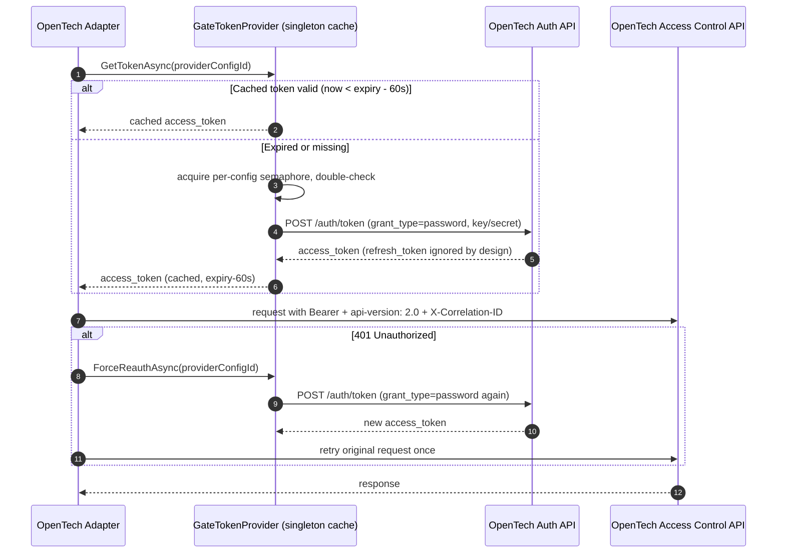

### 4.3 Vendor object model & lifecycle endpoints (v2.0, QA-confirmed)

| Bear trigger | Vendor call | Behavior / notes |
|---|---|---|
| Property linked | `GET /facilities`, `GET /facilities/detail?propertyNumber=` | Discovery for the mapping UI; response is a plain array of `{id, name, propertyNumber}` |
| Unit onboarded | `POST /facilities/{facilityId}/units` `{unitNumber}` | Returns `unit.id` — store it. `unitNumber` must be unique per facility. ⚠ The POC collection accidentally sent this to the *event* host; always target the access-control host |
| Move-in | `POST /facilities/{facilityId}/visitors` `{firstName, lastName, isTenant: true, unitId, accessCode, …}` | Returns `visitor.id` — **capture and store immediately; there is no lookup by external key**. Unit must already exist. `accessCode`: digits only, 1–10 chars, never echoed on reads |
| Delinquent | `POST /facilities/{facilityId}/visitors/{visitorId}/disable` (empty body) | `isEnabled=false`, `isLockedOut=true`; unit status unchanged. Bulk twin: `POST …/units/{unitId}/disable` (all occupants + unit → Delinquent) |
| Reinstate | `POST /facilities/{facilityId}/visitors/{visitorId}/enable` (empty body) | ⚠ The POC sent a leftover JSON body here — the spec defines **no body**; it was silently ignored. Omit it |
| Move-out | `POST /facilities/{facilityId}/units/{unitId}/vacate` (empty body) — **primary, spec-documented** | Deactivates *all* unit visitors and flips unit → Vacant |
| Move-out (single visitor) | `POST /facilities/{facilityId}/visitors/{visitorId}/remove` (empty body) | ⚠ Worked on an `isTenant: true` visitor in QA, but the spec says tenant deactivation requires unit vacate. Treat as capability-gated fallback; confirm with vendor (§22 V-4) |
| Event backfill | `GET {eventUrl}/events/facilities/{facilityId}?minDate&maxDate&limit&offset` | Paged; `204 No Content` = empty page, not an error; dedup key = event `id` |
| Event types | `GET {eventUrl}/events/types` | Cache at startup; includes category names |

⚠ **`timeGroupId`/`accessProfileId` = 0 sentinel:** the confirmed POC request sent literal `0` for both; per schema, `null`/omission is what triggers the documented defaults ("24-hour" time group, "All Access" profile). An explicit `0` targets whatever record has id 0. Bear will **omit both fields unless configured** in `gate_provider_configs.settings`, and this is escalated as vendor question V-7 (§22).

**Access profile scope — client-confirmed:** MVP always requests the vendor's **single default profile** ("24-hour" / "All Access") for every visitor — there is no admin-facing UI to pick a different `timeGroupId`/`accessProfileId` per tenant. Multi-profile, time-window-restricted access is explicitly deferred to a future phase; `gate_provider_configs.settings` may hold an org-wide override, but per-tenant profile selection is out of MVP scope.

`suppressCommands` (batch device pushes) is supported but the vendor flags it for deprecation — Bear defaults it to `false` (real-time pushes) everywhere.

### 4.4 Error semantics & retry taxonomy

| Vendor response | Meaning | Bear behavior |
|---|---|---|
| `200` | Success | Process |
| `204` | Empty event page | Empty page, not an error |
| `400` | Invalid data | **No retry.** Log body, mark operation `failed` for human review |
| `401` | Token expired | New password-grant token once → retry once → else `ExternalServiceException` |
| `403` | Credential/permission problem | No retry; mark config `sync_error`; staff alert (likely rotation/provisioning issue) |
| `404` | Bad facility/unit/visitor id | No retry; flag mapping drift; reconciliation candidate |
| `409` | Already in requested state | **Treat as idempotent success** |
| `5xx` / timeout | Vendor-side failure | Exponential backoff 2s/4s/8s (max 3 in-process attempts via the standard resilience handler), then hand back to the `gate_operations` retry schedule (§13) |

All outbound calls carry `X-Correlation-ID` (propagated by Bear's existing `CorrelationIdDelegatingHandler`), so a Bear request can be traced in vendor logs.

---

## 5. Multi-Tenancy & Account Mapping Strategy

This section answers the four questions raised during design: *how do Bear's Organization→Property→Unit map to OpenTech's Account→Facility→Unit, do we need one OpenTech account or many, who performs the mapping and how, and how do we keep the door open for other providers?*

### 5.1 The mapping model

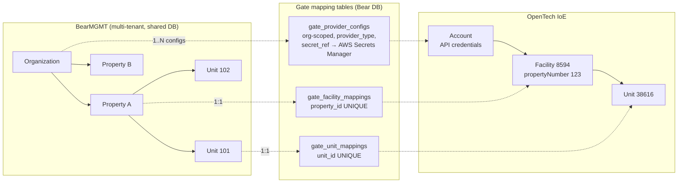

- **Organization ↔ Account** — via `gate_provider_configs`. An organization may hold **multiple** configs (e.g., it acquired facilities that came with their own OpenTech account). This resolves the "one account or many?" question *structurally* instead of by policy: configs are just rows.
- **Property ↔ Facility** — strictly **1:1** (`UNIQUE (property_id)`). A property physically has one gate system; supporting two providers on one gate is not a real scenario and would double every write path. Each facility mapping points at the provider config that owns it. **The facility is created in OpenTech first**, manually, by Bear's Super Admin team (no create-facility API exists) — they set `propertyNumber` = the Bear property's `Code` deliberately, so linking is a deterministic exact-match, not a heuristic (§5.4). **Different properties in the same organization may use entirely different vendors** (client-confirmed) — the `provider_type` on each property's connection can differ, and adding a new vendor is an adapter (§6), not a schema change. Gate integration itself is **fully optional per property** — a property with no facility mapping behaves identically to any other property for every non-gate operation (D10).
- **Unit ↔ vendor Unit** — strictly 1:1 (`UNIQUE (unit_id)`), scoped under its facility mapping. Natural matching key during import: `unitNumber` ↔ `Unit.UnitNumber` (vendor-unique per facility).
- **Tenant/Lease ↔ Visitor** — per active occupancy, on `gate_access_credentials` (§7.4). The vendor-assigned `visitorId` is captured at create time; there is no way to look a visitor up later by a Bear key.

### 5.2 One OpenTech account or one per organization?

**Recommendation: one OpenTech account per organization** (credentials per org). **The schema supports both models**, and because this is ultimately a commercial question (who contracts with OpenTech — each storage operator, or Bear as a reseller?), the final choice is recorded as **client decision C-1 (§22)**.

| Dimension | Per-org accounts (recommended) | Single shared Bear account |
|---|---|---|
| Commercial reality | Each organization contracts with OpenTech; the gate hardware is theirs | Makes Bear a de-facto reseller — a contractual/liability question, not an engineering one |
| Security blast radius | A compromised secret exposes **one org's** gates | One secret exposes **every customer's** gates — hard to accept |
| Tenant isolation | Vendor-side isolation matches Bear-side isolation | Isolation exists only in Bear's mapping tables; `propertyNumber` collisions across orgs become possible |
| Rate limits / throttling | Isolated per account | Shared; one org's bulk sync can starve another (noisy neighbor) |
| Webhook/event routing | Subscription per account; `providerConfigId` in the webhook URL makes attribution trivial | All events in one stream; must route by facility — workable but weaker |
| Offboarding an org | Delete config + secret; clean | Untangle facilities inside a shared account |
| Ops overhead | N secrets, N onboarding flows, N token caches | Simplest ops — the only real advantage |

If the client chooses the single-account model, it is simply *one* `gate_provider_configs` row owned by the platform organization with facility mappings across orgs pointing at it — no schema change. Token caching, webhook routing, and the provider factory are keyed by `providerConfigId` either way.

**Regardless of the account model, the admin experience is property-first, and the admin's API key is a selector — not a credential entry.** All secrets (platform *and* account) are provisioned in Secrets Manager by DevOps up front, each account registered as a connection row with its key fingerprint (§7.2). In each property's gate settings the admin chooses the provider and enters **only the API key**; Bear fingerprints it and looks it up among the org's provisioned connections — **match → verify live → connect the property; no match → nothing created**, clear error ("no provisioned gate account matches this key — contact support/DevOps"). This protects sensitive material from admins entirely while keeping the per-property mental model ("this property runs on OpenTech with this key") and normalized storage: five properties entering the same key connect to **one** connection — one secret, one token cache, one rotation point. An organization can run multiple providers and multiple vendor accounts simultaneously — each property resolves to whichever provisioned connection its key selects.

### 5.3 Who does what (roles & permissions)

| Actor | Responsibility | Permission (§17) |
|---|---|---|
| **Org Admin / Org Owner** | Per property: chooses the provider and enters **only the API key** in the property's gate settings — a *selector* matched by fingerprint against the org's DevOps-provisioned connections (match → connect, no match → contact-DevOps error; nothing created; no secret ever visible or enterable by the admin). Confirms the facility link, triggers unit sync | `gates.configuration.manage` |
| **Super Admin (Bear staff)** | **Creates the property directly in OpenTech's own portal** (no create-facility API exists) before any Bear-side linking can happen, setting `propertyNumber` = the Bear property's `Code` deliberately so the later link is an automatic exact match. Also holds cross-org visibility and troubleshooting (tenant-filter bypass) | `gates.configuration.manage` + tenant bypass |
| **Property staff (manager/staff)** | Day-to-day operations: view credentials, provision/suspend/reinstate/revoke, regenerate codes, view events, retry dead-lettered operations | `gates.access.view` / `gates.access.manage`, `gates.events.view` |
| **Tenant (renter)** | Sees **their own** gate code in the Client Portal, subject to the withholding rules (§16) | Client portal policy + ownership check |

### 5.4 Onboarding flow (per property)

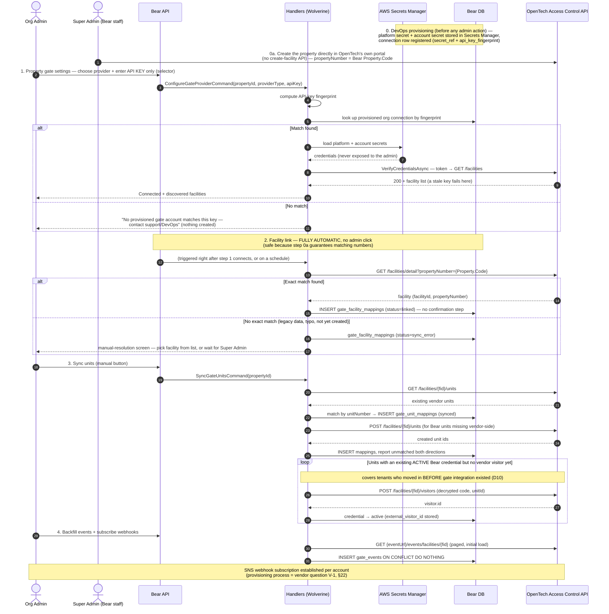

**Facility linking is fully automatic on an exact `propertyNumber` match** (client-confirmed 2026-07-18) — no suggest-then-confirm dropdown in the normal path, because the Super Admin's own convention (step 1a) guarantees the numbers agree. The manual-resolution screen is a **fallback only**, for the rare case where no exact match exists (legacy data migrated before this convention, a typo, or the facility not created yet) — a human still confirms *that* path, since a wrong link there would point gate mutations at the wrong physical property (see Security Notes: validate ids before mutating calls). The **manual Sync button is unit-level only** — there is no property-level sync action, since properties always originate in OpenTech (D9) rather than being pushed from Bear. Sync now also **backfills access codes**: units whose Bear-side credential is already active but has no vendor visitor yet (the property had tenants before gate integration was configured) get their visitor created and code pushed as part of the same sync — this is the reconciliation path for "gate integration added after the fact" (§21.2 lists it as a first-class scenario, not an edge case, precisely because of D10).

**On the `ConfigureGateProviderCommand` fields:** the admin-facing form supplies `propertyId` (the property being configured), `providerType` (vendor name — "OpenTech" today), and `apiKey` (the selector, §5.2). `organizationId` is **resolved server-side from `TenantContext`**, not a free-text field the admin fills in — this follows the same fail-closed multi-tenancy convention every other command in Bear uses (never trust a client-supplied tenant id; see `bear-multitenancy` rules). The property already belongs to an organization, so it's implicit in context, not a separate input.

### 5.5 Switching providers later (OpenTech → PTI/other)

Because of the port/adapter split (§6) and canonical models, a provider switch per property is an operational playbook, not a rewrite:

1. Implement the new adapter (`provider_type = 'pti'` etc.) against `IGateAccessProvider` + a webhook processor if the vendor pushes events.
2. Create the new provider config (new credentials/secret) for the org.
3. Per property: create the new facility mapping in `disabled` status alongside the old, sync units to the new provider.
4. **Re-provision credentials**: for every active `gate_access_credentials` row, decrypt the stored code and create the visitor on the new provider (codes are recoverable precisely because of D5 — a hashed-code design would force issuing every tenant a new code at cutover).
5. Cut over: flip the facility mapping (old → `disabled`, new → `linked`) inside one transaction; enqueue revocations against the old provider.
6. Keep old `gate_events` (they carry `provider_config_id`); decommission the old config once its operations drain.

The main constraint: **one active provider per property at a time** (the `UNIQUE (property_id)` on active mappings). Steps 3–5 therefore stage the new mapping as `disabled` until cutover.

---

## 6. Provider Abstraction (Anti-Corruption Layer)

### 6.1 Component view

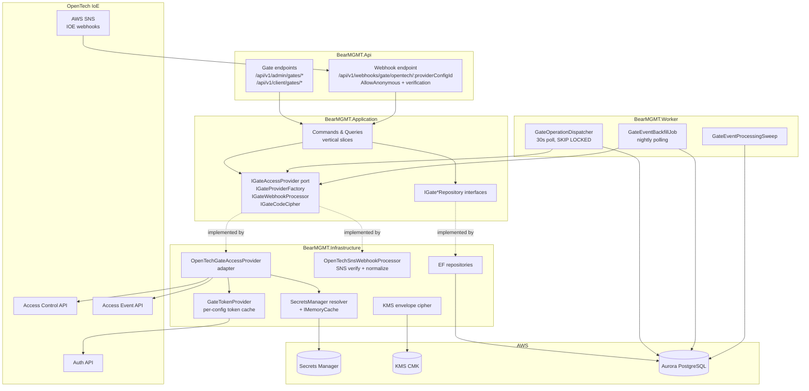

Clean Architecture holds: Api and Worker depend on Application; Infrastructure implements Application interfaces; Domain stays dependency-free. No endpoint or handler ever references a vendor SDK/DTO (mandatory adapter rule).

### 6.2 The port: `IGateAccessProvider`

Defined in `BearMGMT.Application/Gates/`, canonical records only:

```csharp
public interface IGateAccessProvider
{
    GateProviderCapabilities Capabilities { get; }

    Task<IReadOnlyList<GateFacility>> ListFacilitiesAsync(GateProviderContext ctx, CancellationToken ct);
    Task<GateFacility?> GetFacilityByPropertyNumberAsync(GateProviderContext ctx, string propertyNumber, CancellationToken ct);
    Task<IReadOnlyList<GateUnit>> ListUnitsAsync(GateProviderContext ctx, string externalFacilityId, CancellationToken ct);
    Task<GateUnitRef> EnsureUnitAsync(GateProviderContext ctx, string externalFacilityId, GateUnitSpec spec, CancellationToken ct);

    Task<GateVisitorRef> CreateVisitorAsync(GateProviderContext ctx, CreateGateVisitorRequest request, CancellationToken ct);
    Task<IReadOnlyList<GateVisitor>> ListUnitVisitorsAsync(GateProviderContext ctx, string externalFacilityId, string externalUnitId, CancellationToken ct); // reconcile-before-retry (§9.3)
    Task UpdateVisitorAccessCodeAsync(GateProviderContext ctx, GateVisitorRef visitor, string newAccessCode, CancellationToken ct); // capability-gated (V-2)
    Task SuspendVisitorAsync(GateProviderContext ctx, GateVisitorRef visitor, CancellationToken ct);   // OpenTech: /disable
    Task ReinstateVisitorAsync(GateProviderContext ctx, GateVisitorRef visitor, CancellationToken ct); // OpenTech: /enable
    Task RevokeAsync(GateProviderContext ctx, GateRevocationRequest request, CancellationToken ct);    // Mode: UnitVacate | VisitorRemove

    Task<GateEventPage> GetEventsAsync(GateProviderContext ctx, string externalFacilityId, DateTimeOffset since, DateTimeOffset until, int offset, int limit, CancellationToken ct);
    Task VerifyCredentialsAsync(GateProviderContext ctx, CancellationToken ct); // config-time smoke test
}

public sealed record GateProviderCapabilities(
    bool SupportsUnitVacate,          // OpenTech: true
    bool SupportsVisitorRemove,       // OpenTech: true (tenant-remove caveat V-4)
    bool SupportsInPlaceCodeUpdate,   // OpenTech: pending vendor confirmation (V-2)
    bool SupportsWebhooks,            // OpenTech: true (SNS)
    int MinCodeLength, int MaxCodeLength); // OpenTech: 1..10 (Bear enforces ≥ 4)

public sealed record GateProviderContext(Guid OrganizationId, Guid ProviderConfigId, GateProviderSettings Settings);
```

Capability flags let handlers branch without knowing the vendor: e.g., `RevokeAsync` prefers `UnitVacate` when supported (the spec-documented move-out path) and code regeneration falls back to remove+recreate when `SupportsInPlaceCodeUpdate` is false (which changes `external_visitor_id` — the handler must persist the new ref).

### 6.3 The factory: per-config resolution

```csharp
public interface IGateProviderFactory
{
    Task<(IGateAccessProvider Provider, GateProviderContext Context)> CreateAsync(Guid providerConfigId, CancellationToken ct);
}
```

Resolution chain:

1. Load the `gate_provider_configs` row (tenant-filtered).
2. `provider_type` discriminator → adapter via **keyed DI** (`[FromKeyedServices("open_tech")]` registration).
3. Resolve the **connection secret** (account key pair) by `secret_ref` and the provider's **platform secret** (client credentials + base URLs, DevOps-managed) from AWS Secrets Manager; merge them; cache in `IMemoryCache` (~5 min TTL). On a 401 that persists after re-authentication, **evict** both entries — this is how credential rotation propagates without restarts.
4. Build `GateProviderContext` with merged settings (`gate_provider_configs.settings` jsonb over defaults).

Token caching lives in a singleton `GateTokenProvider` keyed by `providerConfigId` (§4.2). The adapter itself is stateless; three named `HttpClient`s (`gate-auth`, `gate-control`, `gate-event`) are registered with `CorrelationIdDelegatingHandler` and inherit the global `AddStandardResilienceHandler()` — no hand-rolled retry loops.

Errors: every vendor failure surfaces as `ExternalServiceException` (→ HTTP 502 via `GlobalExceptionMiddleware`), with response bodies sanitized/truncated before logging (same discipline as `Auth0ErrorBodySanitizer`).

### 6.4 Webhook normalization

Inbound event handling is also vendor-specific (SNS envelopes, signature verification, `SubscriptionConfirmation` handshake), so it sits behind its own port:

```csharp
public interface IGateWebhookProcessor
{
    string ProviderType { get; }  // routes /webhooks/gate/{providerType}/…
    Task<GateWebhookResult> ProcessAsync(Guid providerConfigId, string rawBody, IHeaderDictionary headers, CancellationToken ct);
}
```

`OpenTechSnsWebhookProcessor` (Infrastructure) performs the full SNS pipeline proven in the `IoEWebhook` POC (§14) and emits canonical `GateEvent` rows. The Application layer never sees an SNS envelope.

---

## 7. Database Design

All tables follow Bear conventions: `uuid` PKs defaulting to `gen_random_uuid()`, snake_case names (⚠ remember the EF quirk: `UseSnakeCaseNamingConvention()` does **not** insert an underscore before digits), `AuditableEntity` columns (`created_at`, `created_by`, `updated_at`, `updated_by`, `deleted_at`) with the `auth_bump_updated_at` trigger, `IHasTenant` global query filters on every table (all carry `organization_id`), enums stored as snake_case strings with CHECK constraints derived from the C# enum, and seed/permission data in separate migrations. `gate_events` is append-only like `audit_logs` (block trigger, no `updated_at`).

### 7.1 Entity-relationship overview

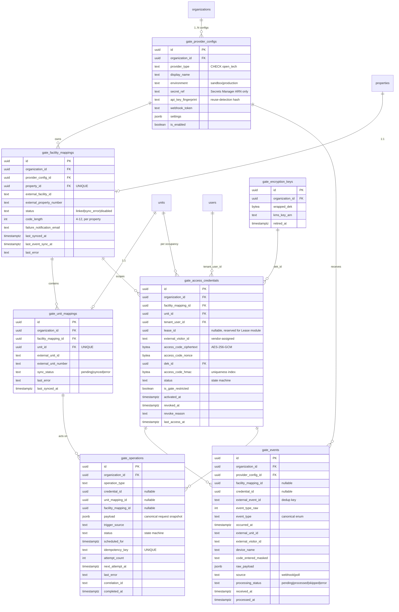

### 7.2 `gate_provider_configs` — vendor account credentials scope

| Column | Type | Notes |
|---|---|---|
| `id` | `uuid` PK | `gen_random_uuid()` |
| `organization_id` | `uuid` FK → organizations | `IHasTenant`; global query filter |
| `provider_type` | `text` | `CHECK (provider_type IN ('open_tech'))` — derived from the `GateProviderType` enum; extend for future providers |
| `display_name` | `text` | `UNIQUE (organization_id, display_name) WHERE deleted_at IS NULL` |
| `environment` | `text` | `CHECK (environment IN ('sandbox','production'))` |
| `secret_ref` | `text` | **AWS Secrets Manager secret name/ARN only. Credentials are never stored in this database.** Secret JSON: `{ apiKey, apiSecret }` — the account pair, **provisioned by DevOps**. Base URLs + `clientId`/`clientSecret` come from the DevOps-managed **platform secret** (§4.2 credential split, Appendix B) |
| `api_key_fingerprint` | `text` | Keyed hash (HMAC-SHA256, module HMAC key) of the API key, **stored at DevOps provisioning time**. `UNIQUE (organization_id, provider_type, api_key_fingerprint) WHERE deleted_at IS NULL` — this is how an admin's entered key *selects* the connection during property setup, without any secret being read or compared. The key is not recoverable from it |
| `webhook_token` | `text` | Random 256-bit token embedded in the webhook URL — defense-in-depth alongside SNS signature verification (§14) |
| `allowed_topic_arns` | `text[]` | SNS topic allow-list (proven pattern from the `IoEWebhook` POC) |
| `settings` | `jsonb` | Provider knobs: `defaultTimeGroupId`/`defaultAccessProfileId` (default: omit — §4.3, single-profile MVP), `revocationMode` override, blocked code patterns. **Code length lives on `gate_facility_mappings` instead** (§7.3) — it's a per-property choice, not per-account |
| `is_enabled` | `boolean` | Disable = stop dispatching operations + reject webhooks for this config |
| audit columns | | `AuditableEntity` + soft delete |

**Creation path (DevOps provisions, admin selects):** rows are created by the **DevOps provisioning process** when an organization's vendor account is set up — secret stored in Secrets Manager, row registered with `secret_ref` + `api_key_fingerprint`. The admin UI never creates or modifies these rows: entering an API key on a property performs a **fingerprint lookup** within the org (match → verify live → link property; no match → contact-DevOps error, nothing created). Storage stays at the account level (not per property) because the credentials belong to the vendor *account*: duplicating them per property would multiply secrets, token caches, and rotation points without isolating anything the facility mapping doesn't already isolate. The row lives under `organization_id` purely for tenant isolation. **N connections per org** naturally covers multiple accounts (acquisitions), multiple providers at once, and the platform-owned single-account case (C-1) — all with zero schema change. Rotation is entirely DevOps-side: update the secret (and fingerprint, if the key itself changed) in place — every property on the connection picks it up via cache eviction, no restart.

### 7.3 Mapping tables

**`gate_facility_mappings`**

| Column | Type | Notes |
|---|---|---|
| `id`, `organization_id` | | standard |
| `provider_config_id` | `uuid` FK | the account this facility lives under |
| `property_id` | `uuid` FK → properties | **`UNIQUE WHERE deleted_at IS NULL`** — one gate system per property (D-note §5.1) |
| `external_facility_id` | `text` | vendor `facilityId` (stored as text — provider-agnostic; OpenTech's is numeric) |
| `external_property_number` | `text` | vendor `propertyNumber` — **the deterministic match key**, since the Super Admin sets it equal to `Property.Code` (D9); no longer just a heuristic hint |
| `status` | `text` | `CHECK (status IN ('linked','sync_error','disabled'))` — `sync_error` now also covers "no exact `propertyNumber` match found at link time" (F11), not only post-link failures like a rotated credential |
| `code_length` | `int` | Client-confirmed: **configurable 4–12 per property** (default 6); lives here, not on `gate_provider_configs`, because one vendor connection can serve multiple properties that may want different lengths. `CHECK (code_length BETWEEN 4 AND 12)` — see the vendor 1–10 conflict flagged in §8.3 |
| `failure_notification_email` | `text` nullable | Client-confirmed MVP feature: alerts this address (in addition to the in-app failure indicator) when a `gate_operations` row for this property dead-letters. Lightweight, direct SES/SMTP send — does **not** depend on the Phase-2 Notifications module (that dependency remains only for the tenant-facing move-in confirmation email, §10) |
| `last_synced_at`, `last_event_sync_at`, `last_error` | | `last_event_sync_at` = polling backfill cursor (§14.4) |

Constraints/indexes: `UNIQUE (provider_config_id, external_facility_id)`; index `(organization_id, status)`.

**`gate_unit_mappings`**

| Column | Type | Notes |
|---|---|---|
| `id`, `organization_id` | | standard |
| `facility_mapping_id` | `uuid` FK | |
| `unit_id` | `uuid` FK → units | **`UNIQUE WHERE deleted_at IS NULL`** |
| `external_unit_id` | `text` | vendor `unitId` — required by visitor create |
| `external_unit_number` | `text` | vendor `unitNumber`; import matching key |
| `sync_status` | `text` | `CHECK (sync_status IN ('pending','synced','error'))` |
| `last_error`, `last_synced_at` | | |

Constraints/indexes: `UNIQUE (facility_mapping_id, external_unit_id)`; index `(facility_mapping_id, sync_status)` for reconciliation sweeps.

### 7.4 `gate_access_credentials` — the core aggregate

| Column | Type | Notes |
|---|---|---|
| `id`, `organization_id` | | standard |
| `facility_mapping_id` | `uuid` FK | |
| `unit_id` | `uuid` FK → units | the unit this code opens |
| `tenant_user_id` | `uuid` FK → users | the renter (Auth user with role `tenant` today) |
| `lease_id` | `uuid` **nullable, no FK yet** | **Reserved column** — deliberate schema debt. Binds to the Lease module in Phase 2 (FK added then); far cheaper than re-keying this table's semantics later |
| `external_visitor_id` | `text` nullable | Vendor-assigned; captured from the create response. `CHECK (status <> 'active' OR external_visitor_id IS NOT NULL)` |
| `access_code_ciphertext` | `bytea` | AES-256-GCM ciphertext (§8) |
| `access_code_nonce` | `bytea` | 96-bit GCM nonce, unique per encryption |
| `dek_id` | `uuid` FK → gate_encryption_keys | enables key rotation |
| `access_code_hmac` | `bytea` | HMAC-SHA256 of the code under a **separate** key — exists solely because ciphertext is non-deterministic and cannot be unique-indexed |
| `status` | `text` | `CHECK (status IN ('pending_activation','active','suspended','revoke_scheduled','revoke_pending','revoked','failed'))` |
| `is_gate_restricted` | `boolean` | The gate-side flag of the 2×2 matrix (§16). Portal restriction lives with the portal/user state — deliberately **not** on this table |
| `activated_at`, `revoked_at`, `revoke_reason` | | |
| `last_access_at` | `timestamptz` | maintained from the event stream — ops/UX signal ("last gate entry") |
| audit columns | | standard; `token`-class fields excluded from audit snapshots via `[AuditIgnore]`-equivalent (§8.5) |

**The uniqueness constraint that enforces TM-009's "unique gate code":**

```sql
CREATE UNIQUE INDEX ux_gate_credentials_code_per_facility
    ON gate_access_credentials (facility_mapping_id, access_code_hmac)
    WHERE status IN ('pending_activation','active','suspended','revoke_scheduled','revoke_pending')
      AND deleted_at IS NULL;
```

A revoked credential releases its code for reuse (partial index), while two *live* credentials can never share a code at one facility — a keypad identifies the person by code alone, so this is a hard functional requirement enforced by the database, not by best-effort application checks.

Other indexes: `(tenant_user_id)`, `(unit_id) WHERE status IN (…live…)`, `(facility_mapping_id, status)`.

**Credential state machine:**

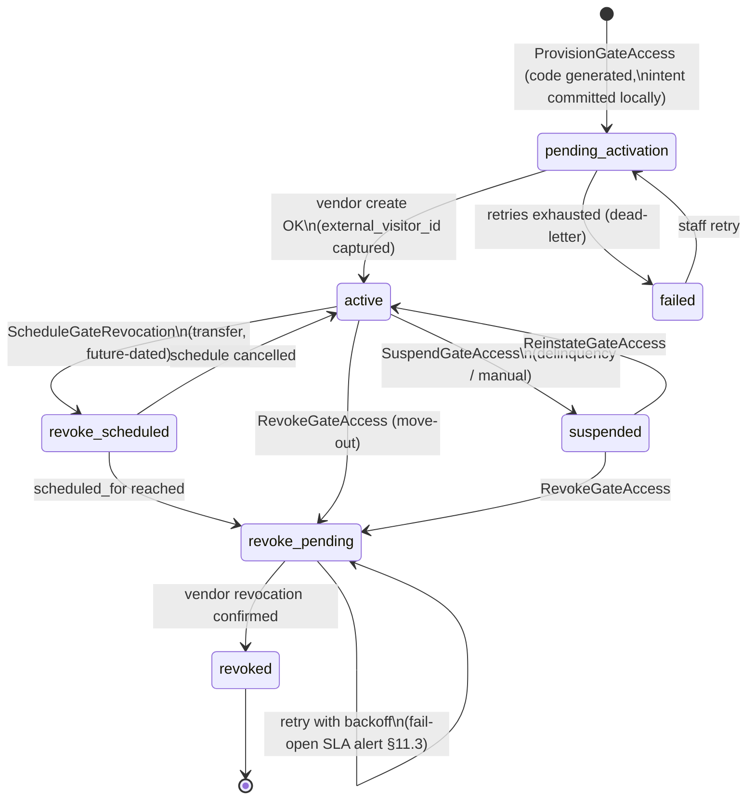

### 7.5 `gate_encryption_keys` — KMS envelope

| Column | Type | Notes |
|---|---|---|
| `id`, `organization_id` | | one **active** DEK per org (partial unique on `organization_id WHERE retired_at IS NULL`) |
| `wrapped_dek` | `bytea` | data key wrapped by the KMS CMK (`GenerateDataKey`) |
| `kms_key_arn` | `text` | which CMK wrapped it |
| `created_at`, `retired_at` | | rotation: new rows use the new DEK; old rows decrypt with their own `dek_id`; lazy re-encrypt on read is optional |

### 7.6 `gate_events` — append-only ingestion

Append-only exactly like `audit_logs`: no `updated_at`/`deleted_at` for the payload columns, plus a block trigger raising on UPDATE of immutable columns / any DELETE (only `processing_status`/`processed_at`/`credential_id`/`facility_mapping_id` are updatable — enforced by a column-restricted trigger).

Key design points:

- **Dedup:** `UNIQUE (provider_config_id, external_event_id)`; all ingestion (webhook *and* polling) is `INSERT … ON CONFLICT DO NOTHING` — the same event arriving from both paths lands once.
- `event_type` canonical values: `access_granted`, `access_denied_invalid_code`, `access_denied_invalid_area`, `access_denied_delinquent`, `access_denied_invalid_time`, `access_denied_loitering`, `door_alarm`, `unit_door_opened`, `unit_door_closed`, `device_offline`, `device_online`, `facility_opened`, `facility_closed`, `unknown` — mapped in the adapter from vendor enums (18, 15, 16, 17, 19, 24, 10, 33, 34, 11, 12, 8, 9, else). `unknown` preserves forward compatibility; `raw_payload` (jsonb) always keeps the full vendor event.
- `code_entered_masked`: vendor events may carry `codeEntered`; Bear stores it **masked** (`****34`) — never the full entered code (§8.5).
- Indexes: **BRIN on `occurred_at`** (large, naturally time-ordered table); btree `(facility_mapping_id, occurred_at DESC)` for the events screen; partial `(processing_status) WHERE processing_status = 'pending'` for the sweep.
- **Growth plan:** monthly range partitioning by `occurred_at` is a stated Phase 3 step, not MVP — but no query may assume a single physical table (always filter by facility + time window; list endpoints paginate via `PagedQuery`).

### 7.7 `gate_operations` — merged outbox + scheduled-action store

One table serves both roles deliberately: a scheduled revocation is just an operation whose `scheduled_for` is in the future and which remains **cancellable and re-datable** until picked up. Splitting outbox and scheduler would duplicate the entire execution machinery (dispatcher, retry, dead-letter, dashboard) for no benefit.

| Column | Type | Notes |
|---|---|---|
| `id`, `organization_id` | | standard |
| `operation_type` | `text` | `CHECK IN ('create_visitor','update_visitor_code','suspend_visitor','reinstate_visitor','remove_visitor','vacate_unit','create_unit','sync_units','backfill_events')` |
| `credential_id` / `unit_mapping_id` / `facility_mapping_id` | `uuid` nullable FKs | whichever applies |
| `payload` | `jsonb` | canonical request snapshot (e.g., the `CreateGateVisitorRequest` minus the plaintext code — the executor decrypts from the credential row at send time; codes never sit in `payload`) |
| `trigger_source` | `text` | `CHECK IN ('move_in','move_out','transfer_scheduled','delinquency','manual','reconciliation','onboarding')` |
| `status` | `text` | `CHECK IN ('scheduled','pending','in_progress','succeeded','failed','dead','cancelled')` |
| `scheduled_for` | `timestamptz` | `now()` for immediate ops; future for transfer revocations — computed in the **property's timezone** (§11.2) |
| `idempotency_key` | `text` `UNIQUE` | e.g. `revoke:{credentialId}:{moveOutDate}` — a re-submitted command lands on the existing row instead of duplicating |
| `attempt_count` | `int` | |
| `next_attempt_at` | `timestamptz` | retry schedule (§13.2) |
| `last_error` | `text` | sanitized |
| `correlation_id` | `text` | end-to-end trace from originating request to vendor call |
| `completed_at` | `timestamptz` | |

Indexes (dispatcher hot paths): partial `(next_attempt_at) WHERE status IN ('pending','failed')`; partial `(scheduled_for) WHERE status = 'scheduled'`; `(credential_id, status)`; `(organization_id, status)` for the ops dashboard.

**Operation state machine:**

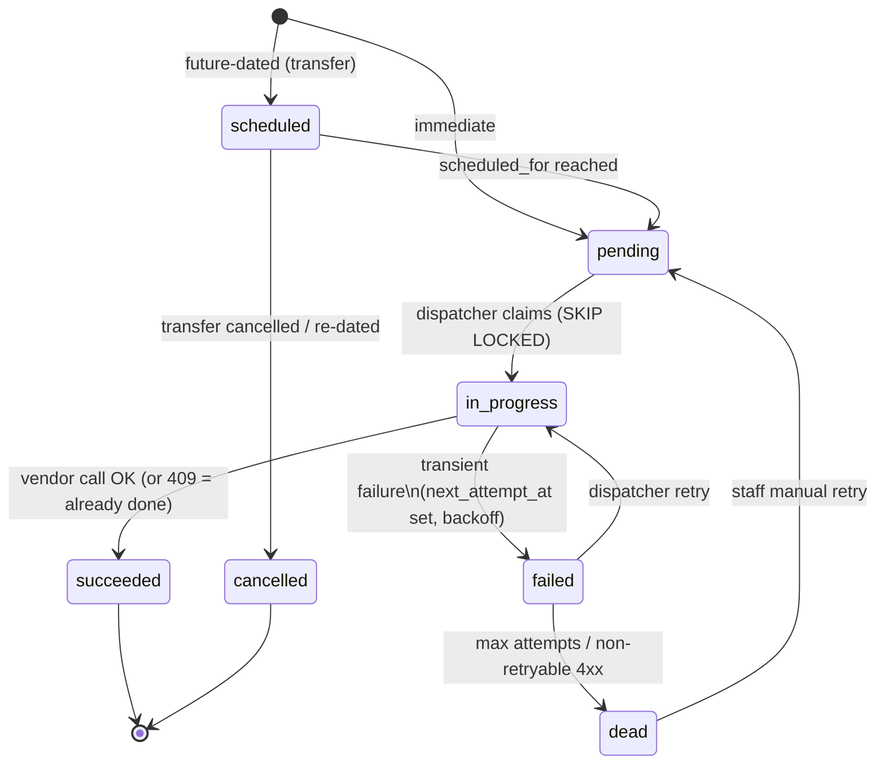

### 7.8 Future sketch (Phase 3): delinquency escalation tables

Documented now so the Payment module builds against a known shape; **not** created in Phase 1:

- `gate_escalation_profiles` — `id`, `organization_id`, `property_id` (nullable = org default), `name`, `is_enabled`.
- `gate_escalation_steps` — `id`, `profile_id`, `overdue_days_threshold` (unique per profile), `action` `CHECK IN ('notification','document_generation','gate_suspend','gate_reinstate','overlock_task')`, `action_settings` jsonb, `is_lien_trigger` (last step). Sorted by day offset; unique per step; last step = lien trigger, per PM-007.

### 7.9 Migration checklist for this module

Standard Bear rules apply: `dotnet ef migrations add` with Designer files; `auth_bump_updated_at` trigger on every new table except `gate_events`; append-only block trigger on `gate_events`; `Down()` drops triggers → children → parents; CHECK constraints derived from C# enums (never raw literals); permission seeds (`gates.*`) in a **separate** migration; verify snake_case names against the digit quirk (`…_v2`-style names are safe; no digit-adjacent columns exist in this schema).

---

## 8. Gate Code Lifecycle & Security

### 8.1 Why the code must be encrypted — and cannot be hashed

The vendor **never returns the access code on any read** (`accessCode` is write-only; reads return `code: null` for tenants). Bear's database is therefore the *only* recoverable copy, and TP-004 requires displaying it to the tenant. A hash is one-way → hashing is functionally impossible here. The code is a live physical-security credential, so plaintext storage is equally unacceptable. Encryption-at-rest with controlled reveal is the only design that satisfies both constraints.

### 8.2 Encryption: application-level AES-256-GCM with KMS envelope — not pgcrypto

| Option | Verdict | Why |
|---|---|---|
| `pgcrypto` (`pgp_sym_encrypt`) | **Rejected** | The key travels inside SQL statement text — it leaks into Postgres logs, `pg_stat_statements`, and RDS Performance Insights; rotation and enveloping are clumsy |
| App-level AES-256-GCM + KMS envelope | **Chosen** | Key never touches the DB tier; standard AWS rotation story; per-org key isolation |
| Hash only | Impossible | Must display to tenant (§8.1) |

Mechanics:

1. One **KMS CMK** for the gate module (per environment).
2. Per organization, a **DEK** is created via `GenerateDataKey`; the *wrapped* DEK is stored in `gate_encryption_keys`; the plaintext DEK is cached in process memory only.
3. Each code is encrypted AES-256-GCM with a fresh 96-bit nonce; `(ciphertext, nonce, dek_id)` land on the credential row.
4. Rotation: mint a new DEK (old row gets `retired_at`); new credentials use it; old rows still decrypt via their own `dek_id`; lazy re-encrypt on read is optional.
5. A **separate HMAC-SHA256 key** (Secrets Manager, never the encryption key) produces `access_code_hmac` for the uniqueness index and for equality lookups (e.g., "which credential does entered code X belong to") without decryption.

The Application layer sees only an `IGateCodeCipher` port (`Encrypt`, `Decrypt`, `ComputeLookupHmac`); KMS specifics stay in Infrastructure.

### 8.3 Generation algorithm

- **Source:** `RandomNumberGenerator` (CSPRNG) — never `Random`.
- **Length:** 6 digits default; **configurable 4–12 per property** (client-confirmed range). Stored as a digit *string* — leading zeros are legal and significant.

  ⚠ **Vendor conflict to flag:** the OpenTech integration guide documents `accessCode` as "digits only, **1–10 characters**, pattern-enforced." A property configured for **11 or 12 digits exceeds the vendor's documented maximum** and may be rejected by `POST /facilities/{facilityId}/visitors` at move-in — after the code has already been generated and committed locally. Two mitigations, both worth doing: (1) `VerifyCredentialsAsync` at provider-connection time should also probe the facility's actual accepted length if the vendor exposes one (unconfirmed — new vendor question V-10, §22); (2) until confirmed, cap the **effective** default/recommended length at 10 in the UI, while still allowing 11–12 as an explicitly-flagged "unverified with vendor" configuration choice rather than silently promising it will work.
- **Rejection filters:** all-same digits (`444444`), full ascending/descending runs (`123456`, `987654`), code == unit number, org-configurable blocklist.
- **Uniqueness scope: the facility** (§7.4's partial unique index). Generate → HMAC → attempt insert; on unique violation, regenerate. Cap at **10 attempts**, then fail loudly (TM-009's failure-message path). Capacity math: at 6 digits (10⁶ space) with ~1,000 live codes per facility, per-attempt collision probability ≈ 0.1% — ten consecutive collisions is ~10⁻³⁰; if it ever happens, something is systematically wrong and failing loudly is correct.

### 8.4 Regeneration & reveal

- **Regenerate** (staff- or tenant-initiated): generate a new code → update ciphertext/HMAC in the local transaction → enqueue `update_visitor_code`. If the provider lacks `SupportsInPlaceCodeUpdate` (vendor question V-2), the executor falls back to **remove + recreate visitor**, which yields a *new* `external_visitor_id` that must be persisted. The old code stops working at the vendor as soon as the operation succeeds.
- **Reveal** (showing the plaintext to staff or tenant) is itself an **audited action**: `gate_code.revealed` with actor, credential id, and portal scope — never the value.

### 8.5 Non-negotiable handling rules

| Rule | Enforcement |
|---|---|
| Codes never appear in logs | No log statement may interpolate the code; structured-log review + code review gate; token request bodies excluded from HTTP logging (§4.2) |
| Codes never appear in audit `before/after` JSON | Credential audit snapshots exclude `access_code_*` fields (same `[AuditIgnore]` discipline as invitation `token_hash`) |
| Codes never sit in `gate_operations.payload` | Executor decrypts from the credential row at send time (§7.7) |
| `codeEntered` from vendor events stored masked | `****34` in `gate_events.code_entered_masked`; full value only inside `raw_payload` jsonb, which is access-restricted like other tenant PII |
| Only two display surfaces | Admin credential detail (staff, `gates.access.view`) and tenant Unit Detail (§16); both server-side gated |
| No codes in URLs | Codes travel only in request/response bodies over TLS |

---

## 9. Consistency Model — What "Atomic" Really Means

### 9.1 The honest contract

MO-003 says move-out actions "execute atomically as a single transaction." An HTTP call to OpenTech **cannot join a Postgres transaction** — as literally stated, that requirement is unbuildable. The contract this architecture implements, and which the client must sign off on (§22 C-4):

> **All local effects commit atomically** (one EF Core transaction: unit status, autopay flag, work order, credential state, outbox row). **The external gate mutation is guaranteed-eventual**: retried with backoff, visible in a pending state, dead-lettered with a staff alert if it cannot complete within the SLA.

### 9.2 The universal ordering rule: DB intent first, vendor call second

Never the reverse. If Bear called the vendor first and crashed before committing, a live gate code would exist with **no Bear record** — an unauditable security hole with no retry path and nothing to reconcile against. With intent-first, the worst case is a `pending` row that retries or dead-letters *visibly*. This asymmetry decides the ordering for every operation in this module.

Corollary: the vendor call happens **after** `SaveChangesAsync` (same pattern as Bear's domain-event dispatch rule), either inline (move-in's fast path) or from the Worker dispatcher.

### 9.3 Idempotency

| Layer | Mechanism |
|---|---|
| Command → operation | `gate_operations.idempotency_key` (UNIQUE) — re-submitting a command lands on the existing row |
| Vendor `409 Conflict` | Treated as success (already in requested state) |
| suspend/reinstate/remove/vacate | Naturally idempotent vendor operations — safe to retry blindly |
| **create_visitor — the hard case** | The vendor accepts **no client-supplied key**, so a retry after an ambiguous timeout could double-create. **Reconcile-before-retry is mandatory**: before any `create_visitor` retry, the executor calls `ListUnitVisitorsAsync` for the target unit and matches on name + enabled state; if a matching visitor exists, it **adopts** that `visitor.id` and marks the operation succeeded instead of re-creating |
| Event ingestion | `ON CONFLICT (provider_config_id, external_event_id) DO NOTHING` (§7.6) |

### 9.4 Why an outbox, not a saga

Gate revocation and suspension are **one-way, idempotent** operations — there is nothing to compensate. A saga with compensating transactions would be over-engineering; a pending-state outbox with retry is strictly simpler and sufficient. The only "compensation-like" behavior in the module is failed *provisioning* (move-in), where the credential goes to `failed` and staff either retry or release the code.

---

## 10. Flow: Tenant Move-In (TM-009)

**Pattern: synchronous attempt, asynchronous guarantee.** The tenant at the counter should see their gate code immediately (happy path: one vendor round-trip, sub-second), but the business flow must not fail if the vendor is slow or down.

1. **Local transaction (Wolverine EF Core transaction):** validate unit mapping exists (else fail with a clear onboarding message) → generate code (§8.3) → insert `gate_access_credentials` (`pending_activation`) → insert `gate_operations` (`create_visitor`, `pending`) → audit record. Commit.
2. **Inline execution (post-commit, ~5s budget):** the same request executes the operation: `CreateVisitorAsync` → capture `external_visitor_id` (mandatory — only correlation key) → credential → `active`, operation → `succeeded`.
3. **Success response:** gate code shown on-screen; `GateAccessProvisioned` notification event raised → Notifications module (Phase 2) emails the move-in confirmation (contracts, unit details, move-in date, next billing date, gate code — but see C-2 §22 on code-in-email risk).
4. **Failure/timeout:** response returns the explicit UX state required by TM-009 — *"Gate code generated; gate activation is in progress"* — and the Worker dispatcher takes over retries. Terminal failure → credential `failed`, staff alert (§19).
5. **Email bounce:** the confirmation email is the tenant's only off-screen channel to the code, so a bounce triggers a **staff alert** — this is a contract on the Notifications module (Phase 2): it must consume delivery-status callbacks (e.g., SES → SNS bounce topic) and raise `GateCodeEmailBounced` → staff task (§21.2).

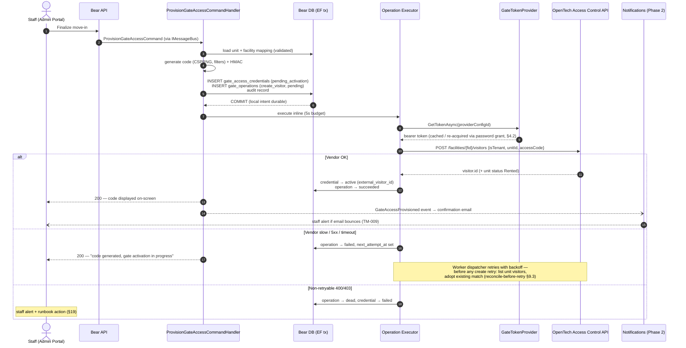

Differences from the original draft sequence diagram: code generation and the credential/outbox insert happen **before** the vendor call (intent-first, D3); the unit is validated as already mapped (unit creation belongs to onboarding §5.4, not move-in); failure paths and the email/bounce leg are explicit; "save visitorId/unitId/accessCode" is a single committed state transition rather than three separate writes after the fact.

---

## 11. Flows: Move-Out & Unit Transfer (MO-003/MO-005, TR-005)

### 11.1 Move-out bundle

All local mutations commit in **one** EF Core transaction — that is the real atomic boundary (§9.1): unit status change, autopay disable (Payment, Phase 3), inspection work order (Maintenance, future), credential → `revoke_pending`, `gate_operations` row. The vendor revocation then executes with retry.

Provider call selection (capability-gated, §6.2): **`vacate_unit` is primary** — it is the spec-documented path for a full tenant move-out *and* the only one that flips the vendor unit status to `Vacant`, keeping the vendor projection consistent (D8). `remove_visitor` is the fallback for partial cases (one of several visitors on a unit — future co-tenant scenario).

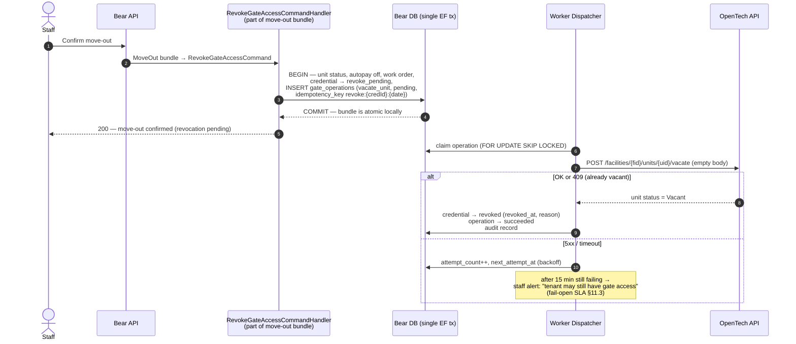

Post-revocation state in Bear (mirrors the guide's §5.3 post-call actions): credential keeps its row forever (`revoked` — audit trail; the code ciphertext is retained but the code is released for reuse by the partial unique index), unit mapping stays (the unit will be re-rented), `Unit.Status` was already updated in the bundle.

### 11.2 Unit transfer (TR-005)

Two independent legs, deliberately asymmetric:

- **New unit — immediate:** a standard move-in flow (§10) issues a **new code** for the new unit right away. The tenant occupies the new unit from day one.
- **Old unit — scheduled:** revocation is **not** immediate. A `gate_operations` row is inserted with `status='scheduled'`, `trigger_source='transfer_scheduled'`, and `scheduled_for` = the old unit's move-out date at the configured cut-over time **in the property's timezone** (`Property.Timezone` exists on the entity; exact cut-over time — end of day? gate closing? — is client question C-3). The credential moves to `revoke_scheduled`.
- **Mutability:** if the move-out date changes, update `scheduled_for`; if the transfer is cancelled, the operation → `cancelled` and the credential returns to `active`. This mutability is exactly why the schedule lives in a queryable DB row and not inside a message broker (§13.1).

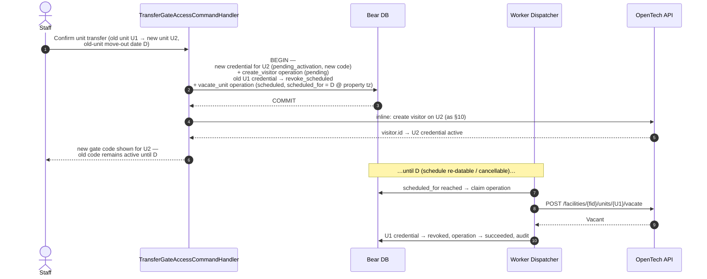

### 11.3 The fail-open SLA

A stuck revocation means the tenant **retains physical access** until a human intervenes — the module fails *open*, not closed, on this path. That residual risk is the honest price of D6 and must carry an explicit SLA: **staff alert after 15 minutes of failed revocation attempts** (configurable; client question C-4), surfaced on the operations dashboard (§18) and via notification. The runbook action is manual: staff can disable the visitor from the OpenTech operator console directly while Bear keeps retrying.

---

## 12. Delinquency Escalation Contract (PM-007)

The Payment module does not exist yet, so PM-007's escalation *engine* is Phase 3 — but its **integration contract is fixed now** so both modules build toward the same boundary, and the gate-side commands ship in Phase 1 (staff can already suspend/reinstate manually).

### 12.1 Which PM-007 actions belong to which module

| PM-007 step action | Owner | Gate module involvement |
|---|---|---|
| Notification | Notifications module | none |
| Document generation | Documents/DocumentTemplates | none |
| **Gate lock** | Gate module | `SuspendGateAccessCommand` → `suspend_visitor` operation → vendor `/disable`; credential → `suspended`, `is_gate_restricted = true` |
| **Gate unlock** | Gate module | `ReinstateGateAccessCommand` → `reinstate_visitor` → vendor `/enable`; credential → `active`, `is_gate_restricted = false` |
| **Overlock unit** | Maintenance/work-order module | ⚠ **Not a gate API call.** An overlock is a *physical padlock* placed on the unit door by staff — OpenTech's API disables keypad access but cannot padlock a door. PM-007's overlock step produces a **work-order/task**, optionally *combined with* a gate suspend |

### 12.2 The event contract (Payment module → gate module, Phase 3)

The Payment module publishes a Wolverine `INotification` after its own state commits:

```csharp
public sealed record TenantDelinquencyStageChanged(
    Guid OrganizationId,
    Guid TenantUserId,
    Guid UnitId,
    Guid? LeaseId,
    int OverdueDays,
    string Stage,               // entered escalation step key
    bool IsReinstatement) : INotification;
```

The escalation engine (Phase 3) maps profile steps (§7.8) to actions; the gate module's only obligations are the two commands above — which are the same commands staff use manually and the same operations the dispatcher already executes. **Bulk unit-level disable** (vendor `POST /units/{unitId}/disable`, which also flips the vendor unit to `Delinquent`) is available via capability flag if the client wants unit-status signaling at the gate; per-visitor disable is the default because it leaves the vendor unit status under Bear's exclusive control (D8).

Delinquency suspension is **reversible state, not revocation**: the visitor and code survive; only `isEnabled` flips. That is exactly the semantics TP-013 needs for "restricted" display (§16).

---

## 13. Scheduled Execution & Worker Architecture

### 13.1 Why a DB-polling dispatcher — and not Wolverine scheduled messages

`WolverineServiceExtensions.cs` configures pipeline behaviors and EF transactions but **no durable message persistence** (`PersistMessagesWith*` is absent). A Wolverine scheduled message therefore lives in process memory and **dies on deploy/restart**. Losing a security revocation scheduled three weeks out (transfer, §11.2) is disqualifying. Additionally, business schedules must be **queryable, auditable, cancellable, and re-datable** — properties a broker-internal message doesn't have. Hangfire is not in the stack. Hence: `gate_operations` is the durable schedule, and `BearMGMT.Worker` (today a stub — this module gives it its first real job) executes it.

Even if/when Wolverine gains durable Postgres transport (worth adopting later for lower dispatch latency), the *business* schedule stays in the table for the reasons above; Wolverine would only replace the polling wake-up.

### 13.2 `GateOperationDispatcher` (BackgroundService in BearMGMT.Worker)

- **Poll loop:** every ~30s (configurable):

```sql
SELECT * FROM gate_operations
WHERE (status = 'pending'   AND next_attempt_at <= now())
   OR (status = 'scheduled' AND scheduled_for  <= now())
ORDER BY scheduled_for NULLS FIRST, next_attempt_at
FOR UPDATE SKIP LOCKED
LIMIT 20;
```

`FOR UPDATE SKIP LOCKED` makes multiple Worker instances safe with no leader election — each claims disjoint rows.

- **Execution:** claimed rows → `in_progress` → resolve provider via `IGateProviderFactory` (per row's config) → execute the canonical operation → `succeeded` / `failed` per the retry taxonomy (§4.4). Every execution stamps `attempt_count`, `last_error` (sanitized), and audit records for state transitions.
- **Retry schedule** (beyond the in-process resilience handler's 3 quick attempts): `next_attempt_at = now() + min(2^attempt_count minutes, 30 min)`, max **~5 dispatcher attempts** (client-confirmed retry policy), then `dead` + staff alert (+ the property's `failure_notification_email` if configured, §7.3). This attempt-count backoff is independent of the fail-open SLA (§11.3) — a revocation-class operation still alerts at the 15-minute wall-clock mark regardless of how many attempts have run by then; the two mechanisms watch different things (exhausted retries vs elapsed time).
- **Tenant context:** the Worker runs outside HTTP, so handlers invoked from it execute with a **system actor** (`TenantContext` populated from the operation row's `organization_id`; audit rows record NULL actor + `metadata.system_actor = "gate-dispatcher"` — the established system-actor pattern).
- **Observability:** queue-depth gauge (`pending`+`scheduled` due), oldest-due-age gauge, per-operation-type success/failure counters (§18).

Two further scheduled jobs share the Worker host: **`GateEventBackfillJob`** (nightly polling sweep, §14.4) and **`GateEventProcessingSweep`** (re-processes `gate_events.processing_status='pending'` rows whose in-process notification was lost, §14.3).

---

## 14. Event Ingestion: Webhooks + Polling Backfill

Real-time gate events (access granted/denied, door alarms, device health) arrive via **IOE webhooks — AWS SNS HTTPS subscriptions**. Polling the Access Event API is only for the initial historical load and a nightly backfill safety net. Guiding rule (D7): **events are observational** — they feed dashboards, alerts, and audit; no business state transition depends on webhook delivery, which is what makes the MVP safe without an SQS layer.

### 14.1 Endpoint & verification chain

`POST /api/v1/webhooks/gate/opentech/{providerConfigId}` — the first inbound-webhook surface in Bear:

- `AllowAnonymous` (SNS cannot authenticate with Bear JWTs), **excluded** from `TenantResolutionMiddleware`, dedicated tight rate-limit bucket.
- Reads the **raw body as string** — SNS posts with `Content-Type: text/plain` (POC-proven; model binding would fail).
- Verification chain, in order (all four proven in the `IoEWebhook` POC):
  1. **Per-config `webhook_token`** (query param) matches `gate_provider_configs.webhook_token` — cheap rejection of noise before any parsing.
  2. **`SigningCertURL` host allow-list** — must match `^https://sns\.[a-z0-9\-]+\.amazonaws\.com(\.cn)?/` **before** invoking SDK verification, otherwise an attacker supplies their own "verifying" certificate.
  3. **SNS signature verification** — `Message.IsMessageSignatureValid()` (AWS SDK).
  4. **`TopicArn` allow-list** — must be in `gate_provider_configs.allowed_topic_arns`.
- `SubscriptionConfirmation`: validate `SubscribeURL` against the same SNS host allow-list, then GET it to confirm; persist the subscription ARN on the config; audit the event. `UnsubscribeConfirmation`: acknowledge + staff alert (an unexpected unsubscribe means events stopped flowing).

### 14.2 Notification handling — fast, durable, dumb

`Notification` messages carry a two-layer envelope (`Message` → `{message_type: "GatewayEvent", message_data: "<json-string>"}` → `GatewayEventModel`). The handler: parse → normalize to canonical event → **`INSERT INTO gate_events … ON CONFLICT (provider_config_id, external_event_id) DO NOTHING`** → **return 200 immediately**. No vendor calls, no heavy processing inline — stay well under SNS's delivery timeout. The `gate_events` table *is* the durable queue for the MVP.

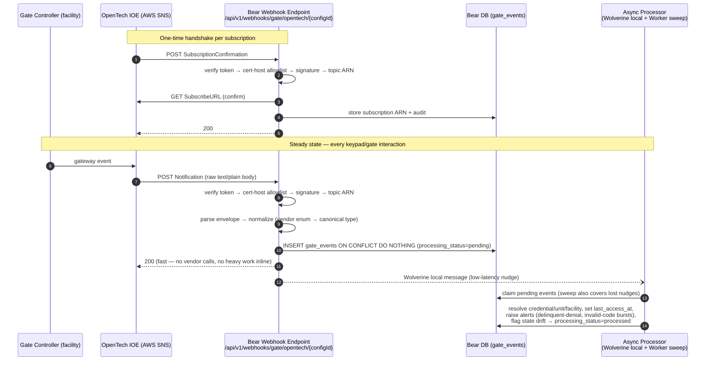

Failure posture: any verification failure → 400 (SNS will retry per its policy); parse failures → 400 with sanitized logging; a *processing* failure never blocks ingestion (the row sits in `pending`/`error` for the sweep). Unknown `message_type` values are acknowledged with 200 and logged — not errors.

### 14.3 Asynchronous processing (belt and braces)

Post-insert, the endpoint publishes a lightweight Wolverine local message for low-latency processing, **and** the Worker's `GateEventProcessingSweep` periodically claims `processing_status='pending'` rows — covering nudges lost to restarts (Wolverine local messages are in-memory, §13.1). Processing responsibilities:

- Resolve `credential_id` / `facility_mapping_id` from external ids.
- `access_granted` → update `gate_access_credentials.last_access_at`.
- `access_denied_delinquent` and repeated `access_denied_invalid_code` from one device → staff alert (someone locked out at the physical gate is a support call about to happen).
- **Drift detection:** an `access_granted` for a credential Bear believes is `revoked`/`suspended` is a serious inconsistency → high-priority alert + reconciliation.

### 14.4 Polling backfill & reconciliation

Nightly (and on-demand per facility), `GateEventBackfillJob` pages `GET {eventUrl}/events/facilities/{facilityId}?minDate={last_event_sync_at}&maxDate={now}` with the same conflict-ignoring insert. `204` = empty page. Cursor: `gate_facility_mappings.last_event_sync_at`, advanced only after a fully ingested range. This closes SNS delivery gaps (SNS HTTP retries are finite) and doubles as the initial historical load during onboarding (§5.4).

### 14.5 Target state (Phase 3): SNS → SQS → Worker

Subscribe the SNS topic to an SQS queue and consume from the Worker instead of terminating webhooks in the API. Gains: ingestion decoupled from API deploys/uptime, native DLQ semantics, backpressure. This is also the natural moment to adopt Wolverine's durable transport. The MVP design stays honest without it because of D7 — nothing but observability latency degrades if webhook delivery lags.

### 14.6 Physical access flow (context)

What happens at the keypad is entirely vendor-side; Bear only ever *learns about it* through the event stream — worth keeping in mind when reasoning about latency (a suspend that hasn't reached the gate controller yet will still admit the tenant):

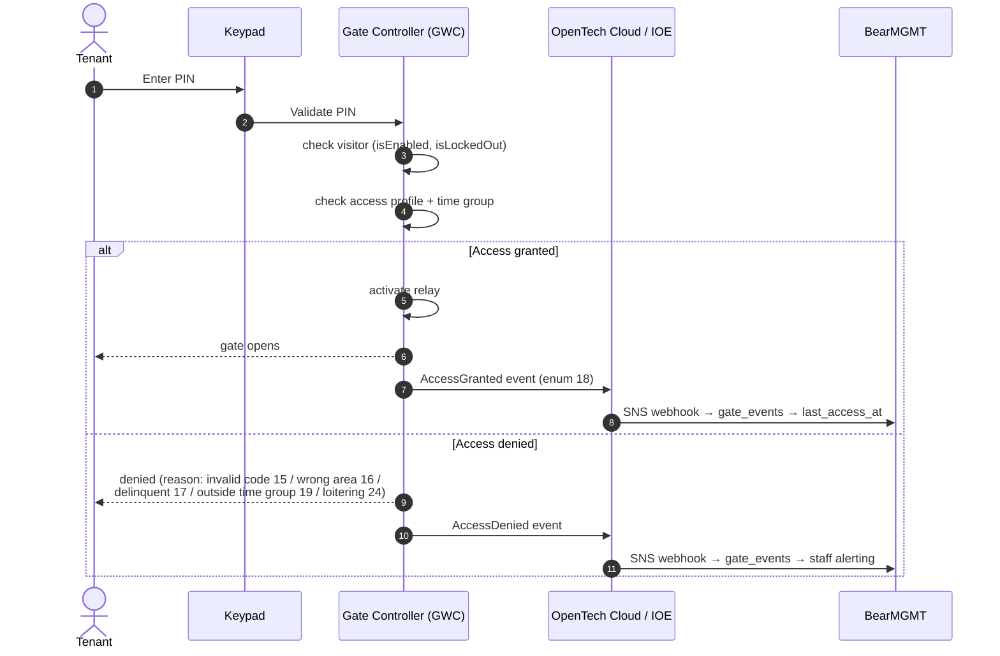

---

## 15. Application Layer Design (Vertical Slices)

The module lives at `src/BearMGMT.Application/Gates/` following the mandatory conventions: one operation folder per slice; command record + handler class in **one** file (`{Verb}{Noun}CommandHandler.cs`); separate validator and result files; all dispatch via `IMessageBus.InvokeAsync`; `[RequiresPermission]` on every command/query; audit + structured logging in every handler; list queries extend `PagedQuery` and return `PagedResult<T>`.

### 15.1 Slice catalog

| Slice folder | Message | Kind | Permission (portal) | Notes |
|---|---|---|---|---|
| `ConfigureGateProvider/` | `ConfigureGateProviderCommand` | cmd | `gates.configuration.manage` (Admin) | invoked from **property** gate settings (providerType + apiKey only); fingerprint lookup against DevOps-provisioned connections → match: verify live + connect, no match: error, nothing created |
| `ListGateFacilities/` | `ListGateFacilitiesQuery` | qry | `gates.configuration.view` (Admin) | vendor discovery for the mapping UI |
| `LinkGateFacility/` | `LinkGateFacilityCommand` | cmd | `gates.configuration.manage` (Admin) | auto-invoked on exact `propertyNumber` match after connect; the *manual* path (this command exposed to admins) is the **fallback only**, used from the resolution screen when no exact match exists |
| `SyncGateUnits/` | `SyncGateUnitsCommand` | cmd | `gates.configuration.manage` (Admin) | manual button, unit-level only (no property sync — properties always originate in OpenTech, D9); import/create/reconcile unit mappings **and** push access codes for units with an active Bear credential but no vendor visitor yet (backfill for gate-added-after-the-fact, D10) |
| `ProvisionGateAccess/` | `ProvisionGateAccessCommand` | cmd | `gates.access.manage` (Admin) | move-in (§10); Phase 2: invoked by Lease handler via `IMessageBus` composition |
| `SuspendGateAccess/` | `SuspendGateAccessCommand` | cmd | `gates.access.manage` (Admin) | delinquency lock / manual |
| `ReinstateGateAccess/` | `ReinstateGateAccessCommand` | cmd | `gates.access.manage` (Admin) | unlock |
| `RevokeGateAccess/` | `RevokeGateAccessCommand` | cmd | `gates.access.manage` (Admin) | move-out (§11.1) |
| `ScheduleGateRevocation/` | `ScheduleGateRevocationCommand` | cmd | `gates.access.manage` (Admin) | transfer old-unit leg (§11.2); also `CancelScheduledGateRevocation` |
| `RegenerateGateCode/` | `RegenerateGateCodeCommand` | cmd | `gates.access.manage` (Admin) | §8.4 |
| `GetGateCredential/` | `GetGateCredentialQuery` | qry | `gates.access.view` (Admin) | staff detail incl. reveal (audited) |
| `GetTenantGateCode/` | `GetTenantGateCodeQuery` | qry | Client portal + ownership | **server-side withholding** (§16); 404-not-403 on ownership miss |
| `ListGateEvents/` | `ListGateEventsQuery : PagedQuery` | qry | `gates.events.view` (Admin) | filters: property, unit, event type, date range; sort-field allowlist |
| `ListGateOperations/` | `ListGateOperationsQuery : PagedQuery` | qry | `gates.access.view` (Admin) | ops dashboard incl. dead-letter |
| `RetryGateOperation/` | `RetryGateOperationCommand` | cmd | `gates.access.manage` (Admin) | `dead` → `pending` |
| `IngestGateWebhook/` | `IngestGateWebhookCommand` | cmd | *(internal — dispatched by webhook endpoint, no portal)* | documented AuthorizationBehavior exception: endpoint-verified (§14.1), command not externally reachable |

Handlers stay single-job (rule 17): the move-in *bundle* (Phase 2) is composed by the Lease module's handler invoking `ProvisionGateAccessCommand` via `IMessageBus`, not by a mega-handler.

### 15.2 Representative combined-handler file (convention illustration)

```csharp
// src/BearMGMT.Application/Gates/SuspendGateAccess/SuspendGateAccessCommandHandler.cs

[RequiresPermission(Permissions.Gates.Manage, PortalScope.Admin)]
public sealed record SuspendGateAccessCommand(Guid CredentialId, string? Reason);

public sealed class SuspendGateAccessCommandHandler(
    IGateCredentialRepository credentialRepository,
    IGateOperationRepository operationRepository,
    IAuditService auditService,
    ICurrentUserService currentUser,
    ILogger<SuspendGateAccessCommandHandler> logger)
{
    public async Task<SuspendGateAccessResult> Handle(SuspendGateAccessCommand command, CancellationToken ct)
    {
        logger.LogInformation(BearAuthLogEvents.GateAccessSuspendRequested,
            "Suspending gate access for credential {CredentialId}", command.CredentialId);

        var credential = await credentialRepository.GetByIdAsync(command.CredentialId, ct)
            ?? throw new NotFoundException("Gate credential not found.");

        credential.Suspend(command.Reason);          // domain state machine: active → suspended, is_gate_restricted = true

        operationRepository.Enqueue(GateOperation.SuspendVisitor(credential, currentUser.CorrelationId));

        auditService.Record(new AuditLog
        {
            OrganizationId = credential.OrganizationId,
            ActorUserId = currentUser.UserId,
            ActorMembershipId = currentUser.MembershipId,
            TargetTable = AuditTargetTables.GateAccessCredentials,
            TargetId = credential.Id,
            Action = SecurityAuditActions.GateAccessSuspended,
            BeforeState = /* snapshot WITHOUT access_code_* fields */ null,
            AfterState = /* snapshot WITHOUT access_code_* fields */ null,
            PortalScope = AuditPortalScope.Admin,
            Metadata = "{}",
        });

        await credentialRepository.SaveChangesAsync(ct);   // credential + operation + audit commit atomically

        logger.LogInformation(BearAuthLogEvents.GateAccessSuspended,
            "Gate access suspended for credential {CredentialId}; operation enqueued", credential.Id);

        return SuspendGateAccessResult.FromEntity(credential);
    }
}
```

Domain entities (`GateProviderConfig`, `GateFacilityMapping`, `GateUnitMapping`, `GateAccessCredential`, `GateEvent`, `GateOperation`) live in `src/BearMGMT.Domain/Gates/` — sealed, `AuditableEntity` + `IHasTenant` (except `GateEvent`, which is append-only like `AuditLog`), state transitions as aggregate methods (`Suspend()`, `Activate(externalVisitorId)`, `ScheduleRevocation(at)`, …) raising domain events where useful, zero external dependencies.

### 15.3 Endpoint map

| Route | Verb | Dispatches | Portal policy |
|---|---|---|---|
| `/api/v1/admin/gates/properties/{propertyId}/provider` | POST | `ConfigureGateProviderCommand` (provider + API key as selector, per property) | AdminPortal |
| `/api/v1/admin/gates/configs` | GET | read-only connections list (which properties share which connection — visibility/rotation only) | AdminPortal |
| `/api/v1/admin/gates/properties/{propertyId}/facilities` | GET | `ListGateFacilitiesQuery` — used only by the **manual-resolution screen** (no exact match found); the normal path links automatically | AdminPortal |
| `/api/v1/admin/gates/properties/{propertyId}/link` | POST | `LinkGateFacilityCommand` — **manual override only**, for the no-exact-match fallback | AdminPortal |
| `/api/v1/admin/gates/properties/{propertyId}/sync-units` | POST | `SyncGateUnitsCommand` — the only manual sync action; unit-level, includes credential/code backfill | AdminPortal |
| `/api/v1/admin/gates/credentials` | POST | `ProvisionGateAccessCommand` | AdminPortal |
| `/api/v1/admin/gates/credentials/{id}` | GET | `GetGateCredentialQuery` | AdminPortal |
| `/api/v1/admin/gates/credentials/{id}/suspend` `/reinstate` `/revoke` `/regenerate-code` | POST | respective commands | AdminPortal |
| `/api/v1/admin/gates/credentials/{id}/schedule-revocation` | POST/DELETE | schedule / cancel | AdminPortal |
| `/api/v1/admin/gates/events` | GET | `ListGateEventsQuery` (paged) | AdminPortal |
| `/api/v1/admin/gates/operations` | GET | `ListGateOperationsQuery` (paged) | AdminPortal |
| `/api/v1/admin/gates/operations/{id}/retry` | POST | `RetryGateOperationCommand` | AdminPortal |
| `/api/v1/client/gates/my-code` | GET | `GetTenantGateCodeQuery` | ClientPortal |
| `/api/v1/webhooks/gate/opentech/{providerConfigId}` | POST | `IngestGateWebhookCommand` | **AllowAnonymous** + §14.1 verification |

One static class `GateEndpoints` (plus `GateWebhookEndpoints`) in `src/BearMGMT.Api/Endpoints/Gates/`; portal policy on the group; thin bodies; RFC 9457 errors via the global middleware; auth-tier rate limiting on the webhook route.

---

## 16. Tenant Portal Display & the 2×2 Restriction Matrix (TP-004/TP-013)

### 16.0 Zeroth state — no gate system configured at all (client-confirmed)

Before the 2×2 matrix even applies: if the **property has no `gate_facility_mappings` row** (or it isn't `linked`), the gate-code section is **hidden from the tenant UI entirely** — not shown-and-empty, not struck-through, simply absent. This is a distinct third state from "configured but restricted," and it's why `GetTenantGateCodeQueryHandler` checks facility-mapping existence **before** it ever reaches the credential/restriction logic below.

### 16.1 The 2×2 matrix (property has gate integration configured)

Gate restriction (`gate_access_credentials.is_gate_restricted`, mirrors the vendor `isEnabled=false` state) and **portal-access restriction** (delinquency lockout of the Client Portal itself — a portal/user concern that deliberately does *not* live on the gate credential) are **independent states**:

| | Portal access OK | Portal restricted |
|---|---|---|
| **Gate access OK** | Normal: code displayed in plain text in Unit Detail | Tenant cannot reach the portal (or reaches a restricted shell) — gate still works physically; code not viewable online |
| **Gate restricted** | Portal loads; Unit Detail shows the code **struck-through with a lock icon** and tooltip "contact your property manager"; **the code value itself is absent from the response** | Both restricted: no portal, no gate |

**Server-side withholding is the load-bearing requirement:** when gate access is restricted, `GetTenantGateCodeQueryHandler` **omits the code from the DTO entirely** — the response carries `isRestricted: true` and no code field. The frontend renders the struck-through placeholder from the flag alone. "Hidden client-side" (code present in JSON but not rendered) is explicitly non-compliant with TP-004.

```csharp
// inside GetTenantGateCodeQueryHandler — configured? → ownership → withholding
var facilityMapping = await facilityMappingRepository.GetLinkedByPropertyIdAsync(unit.PropertyId, ct);
if (facilityMapping is null)
    return TenantGateCodeResult.NotConfigured();          // §16.0 — section hidden entirely, no code field, no isRestricted field

if (credential.TenantUserId != currentUser.UserId)
    throw new NotFoundException("Gate code not found.");  // 404, not 403 — no enumeration leak

var showCode = credential.Status == GateCredentialStatus.Active && !credential.IsGateRestricted;
return TenantGateCodeResult.Configured(
    UnitNumber: unit.UnitNumber,
    IsRestricted: !showCode,
    GateCode: showCode ? await codeCipher.DecryptAsync(credential, ct) : null,  // null = JSON field omitted
    LastAccessAt: credential.LastAccessAt);
```

Every reveal through this query is audited (`gate_code.revealed`, client portal scope). The "gate-system integration manages gate state independently of the portal/OMS" dependency in the requirement is exactly this module — the flags feeding both surfaces come from `gate_access_credentials`, which the OMS owns.

---

## 17. Authorization & Permissions

New permission codes (constants in `Permissions.cs` — never string literals):

```csharp
public static class Gates
{
    public const string ConfigurationView   = "gates.configuration.view";
    public const string ConfigurationManage = "gates.configuration.manage";
    public const string View                = "gates.access.view";
    public const string Manage              = "gates.access.manage";
    public const string EventsView          = "gates.events.view";
}
```

Seeded role grants (separate seed migration, `ON CONFLICT DO NOTHING`):

| Role | configuration.view | configuration.manage | access.view | access.manage | events.view |
|---|---|---|---|---|---|
| `super_admin` | ✔ (bypass) | ✔ | ✔ | ✔ | ✔ |
| `org_owner` / `org_admin` | ✔ | ✔ | ✔ | ✔ | ✔ |
| `manager` | ✔ | — | ✔ | ✔ | ✔ |
| `staff` | — | — | ✔ | ✔ | ✔ |
| `viewer` / `read_only` | — | — | ✔ | — | ✔ |
| `tenant` | — | — | own code only (ownership check, not permission) | — | — |

Enforcement layers as everywhere in Bear: portal policy on the route group → `AuthorizationBehavior` (fail-closed) on the command/query → handler ownership checks (404-not-403) → EF global tenant filters on every gate table. The one documented exception: `IngestGateWebhookCommand` carries no `[RequiresPermission]` because its caller is the §14.1-verified anonymous endpoint and the command is not dispatchable from any external surface — this exception is documented in code per the fail-closed rule's escape-hatch convention.

---

## 18. Observability, Audit & Alerting

### 18.1 Structured log events — block **9600–9699** (next free module block)

| Range | Events (examples) |
|---|---|
| 9600–9609 | Provider config: created, verified, verification_failed, disabled, secret_rotated |
| 9610–9619 | Mapping: facility_linked, facility_link_failed, units_synced, unit_sync_conflict |
| 9620–9634 | Credential lifecycle: provision_requested, activated, activation_failed, suspended, reinstated, revoke_requested, revoke_scheduled, revoked, revocation_failed, code_regenerated |
| 9635–9639 | Code security: code_revealed (staff), code_revealed_tenant, reveal_denied |
| 9640–9654 | Operations: dispatched, succeeded, retry_scheduled, dead_lettered, manually_retried, reconcile_adopted_visitor |
| 9655–9669 | Webhook/events: received, signature_rejected, topic_rejected, subscription_confirmed, unsubscribe_received, event_ingested, event_processing_failed, drift_detected |
| 9670–9679 | Backfill/polling: started, page_ingested, completed, failed |
| 9680–9689 | Token/vendor client: token_acquired, token_acquisition_failed, vendor_call_failed |

**Never logged:** gate codes, vendor API secrets, token request bodies, full `codeEntered` values. IDs and correlation tokens only (no tenant PII in tags — `bear.gates.credential_id`, `bear.gates.facility_mapping_id`, `bear.gates.provider_config_id`).

### 18.2 Audit constants

- `AuditTargetTables`: `GateProviderConfigs`, `GateFacilityMappings`, `GateUnitMappings`, `GateAccessCredentials`, `GateOperations`.
- `SecurityAuditActions`: `gate_config.created`, `gate_config.verified`, `gate_facility.linked`, `gate_units.synced`, `gate_access.provisioned`, `gate_access.activated`, `gate_access.suspended`, `gate_access.reinstated`, `gate_access.revoke_scheduled`, `gate_access.revoked`, `gate_code.regenerated`, `gate_code.revealed`, `gate_operation.dead_lettered`, `gate_operation.retried`, `gate_webhook.subscription_confirmed`.
- Credential audit snapshots **exclude** `access_code_ciphertext/nonce/hmac` (§8.5).

### 18.3 Metrics (OTel counters/gauges alongside `BearAuthMetrics` — a `BearGateMetrics` class)

| Metric | Type | Tags |
|---|---|---|
| `bear.gates.operations.dispatched` / `.succeeded` / `.failed` / `.dead` | counter | operation_type, provider_type |
| `bear.gates.operations.queue_depth` / `.oldest_due_seconds` | gauge | — |
| `bear.gates.revocation.pending_over_sla` | gauge | — (drives the fail-open alert §11.3) |
| `bear.gates.webhook.received` / `.rejected` | counter | reason |
| `bear.gates.events.ingested` | counter | source (webhook/poll), event_type |
| `bear.gates.vendor.calls` / `.failures` | counter | host, status_class |
| `bear.gates.token.acquisitions` / `.acquisition_failures` | counter | provider_config (id tag) |

### 18.4 Alerts

| Condition | Severity | Channel |
|---|---|---|
| Revocation pending > SLA (default 15 min) | **High** — tenant retains access | Staff notification + dashboard + property's `failure_notification_email` if configured |
| Operation dead-lettered | High | Staff task + dashboard + property's `failure_notification_email` if configured (client-confirmed MVP feature, §7.3) |
| Provision failed terminally (TM-009 failure message) | Medium | Staff task + on-screen state |
| Drift detected (granted event for revoked credential) | **High** | Staff + engineering |
| Webhook signature/topic rejections spike | Medium | Engineering (possible probing) |
| `UnsubscribeConfirmation` received | Medium | Engineering (event flow stopped) |
| Confirmation-email bounce (Phase 2) | Medium | Staff task (TM-009) |
| Backfill job failure ×2 consecutive | Medium | Engineering |

---

## 19. Failure Modes & Runbook

| # | Failure | System behavior | Staff/engineer remediation |
|---|---|---|---|
| F1 | Code generation exhausts 10 collision attempts | Command fails with TM-009 failure message; nothing persisted | Investigate code-space saturation / blocklist config; retry provisioning |
| F2 | Vendor down during move-in | Credential `pending_activation`; UX: "activation in progress"; dispatcher retries | None usually; if dead-lettered → retry from ops dashboard; verbal/manual gate entry per property procedure |
| F3 | Ambiguous timeout on create_visitor | Reconcile-before-retry adopts existing visitor if present (§9.3) | If reconcile mismatches (name collision), resolve manually in ops dashboard: adopt id or remove vendor duplicate |
| F4 | Revocation failing > SLA | `revoke_pending` + high-severity alert (fail-open §11.3) | Disable visitor directly in OpenTech operator console; Bear retry will land 409 → success |
| F5 | Scheduled transfer revocation missed (Worker outage) | Rows execute on next Worker start (schedule is durable in DB) | Check Worker health; oldest-due-age gauge catches silent stalls |
| F6 | Webhook flow stops (unsubscribe / SNS misconfig) | Nightly backfill still ingests events; alert on unsubscribe | Re-establish subscription with vendor support; run on-demand backfill |
| F7 | 403 from vendor (credential rotation/expiry) | Config → `sync_error`; operations pause for that config; alert | Rotate secret in Secrets Manager (config UI); `VerifyCredentialsAsync` re-activates |
| F8 | Facility linked to wrong vendor facility | Mutations target wrong property — **highest-impact human error** | Prevention: linking is automatic only on an **exact** `propertyNumber` match (no fuzzy auto-link) + `VerifyCredentialsAsync`; any non-exact case routes to the manual-resolution screen instead of guessing. Remediation: unlink (blocked while live credentials exist), relink, resync |
| F9 | Drift: vendor grants access for revoked credential | Drift alert (§14.3) | Immediate manual disable at vendor; reconciliation job comparing Bear live credentials vs `GET /facilities/{fid}/unitvisitorstatus` |
| F10 | Email bounce on move-in confirmation | `GateCodeEmailBounced` → staff task (Phase 2) | Contact tenant through alternate channel; code remains visible in both portals |
| F11 | No exact `propertyNumber` match at auto-link time (Super Admin hasn't created the OpenTech property yet, or numbers were set before the matching convention existed) | Mapping stuck in `sync_error`; gate integration unusable for the property until resolved | Manual-resolution screen: admin picks from the connection's unlinked facilities (same sanity checks as before — unit-count comparison); or wait for Super Admin to create/correct the OpenTech-side property number |
| F12 | Property configured for 11–12 digit codes; vendor rejects `accessCode` as invalid (documented max is 10, §8.3, V-10) | Provisioning fails at the vendor call | Cap effective length at 10 until V-10 is confirmed with the vendor; surface the vendor's actual validation error rather than a generic failure |

---

## 20. Testing Strategy

| Layer | Project | What |
|---|---|---|
| Handler unit tests | `BearMGMT.UnitTests` | Every command/query handler ≥ 90% branch/line: state-machine transitions (all edges in §7.4/§7.7 diagrams), code generation (filters, collision retry, cap), withholding logic (all four matrix cells §16), reconcile-before-retry branches, retry taxonomy per status code. `NSubstitute` mocks for `IGateAccessProvider`/repos; naming `MethodName_Condition_ExpectedResult()` |
| Domain tests | `BearMGMT.UnitTests` | `GateAccessCredential`/`GateOperation` aggregate methods reject invalid transitions (e.g., `Suspend()` on `revoked` throws `ConflictException`) |
| Adapter tests | `BearMGMT.UnitTests` | OpenTech adapter against a fake `HttpMessageHandler`: header injection (`api-version`, correlation id), password-grant body shape, 401-reauth-retry-once, 409-as-success, error sanitization; SNS processor against captured POC payloads (signature verification with test certs, cert-host allowlist bypass attempts, envelope parsing) |
| Integration tests | `BearMGMT.IntegrationTests` | `WebApplicationFactory<Program>`: endpoint auth (admin vs client vs anonymous webhook), tenant isolation across orgs (org A cannot read org B's credentials), dedup insert under concurrency, dispatcher `SKIP LOCKED` with two concurrent claimants, migration up/down |
| Architecture tests | `BearMGMT.ArchitectureTests` | NetArchTest: no vendor DTO types outside Infrastructure; Application has no reference to AWS SDKs; Domain purity holds |
| Contract tests | `BearMGMT.ContractTests` | Canonical record shapes frozen; vendor-facing request shapes pinned against the QA-validated examples (Appendix A) |
| QA sandbox smoke | `BearMGMT.SmokeTests` (opt-in, credentials via user-secrets) | The POC's proven end-to-end loop: token → facility → unit → visitor create/disable/enable/vacate → events poll — run against the vendor QA environment before releases |
| Webhook simulation | dev tooling | Replay captured SNS payloads (SubscriptionConfirmation + Notification) against a local endpoint; ngrok-style tunnel for live QA subscription tests (as done in the `IoEWebhook` POC) |

---

## 21. Phased Delivery Plan & Module Dependencies

### 21.1 What ships when

| Phase | Deliverables | Depends on |
|---|---|---|
| **1 — MVP core** | Domain entities + migrations (7 tables), permissions seed, provider port + OpenTech adapter + token provider, Secrets Manager + KMS cipher, all §15 slices (staff-triggered), Worker dispatcher + backfill + sweep, webhook endpoint + SNS pipeline, admin endpoints, ops dashboard queries, observability | Nothing — Properties & Units exist |
| **2 — Lease & tenant experience** | Lease module invokes `ProvisionGateAccessCommand`/`RevokeGateAccessCommand`/transfer composition; `lease_id` FK added; move-out bundle wiring; tenant portal `my-code` endpoint + 2×2 display; confirmation email + bounce alert | **Lease/Contract module**, **Notifications module** |
| **3 — Delinquency & hardening** | Escalation profiles/steps + engine consuming `TenantDelinquencyStageChanged`; overlock work-order integration; SNS→SQS; `gate_events` partitioning; optional additional provider adapter | **Payment module** (and Maintenance for overlock tasks) |

### 21.2 Contracts future modules must fulfil

- **Lease/Contract module:** on move-in finalization, invoke `ProvisionGateAccessCommand(unitId, tenantUserId, leaseId)`; on move-out confirmation, include `RevokeGateAccessCommand` in its bundle transaction; on transfer, invoke provision + `ScheduleGateRevocationCommand`; publish lease-end domain events so scheduled revocation can also key off lease expiry (TM-009 "auto-deactivates when lease ends").
- **Notifications module:** consume `GateAccessProvisioned` → move-in confirmation email containing the code (pending C-2); consume provider delivery-status callbacks and publish `GateCodeEmailBounced(tenantUserId, credentialId)` → staff task (TM-009 bounce alert).
- **Payment module:** publish `TenantDelinquencyStageChanged` (§12.2) after its own commit; never call the vendor directly.
- **Maintenance module:** accept work-order creation from the move-out bundle and from escalation `overlock_task` steps.

---

## 22. Open Questions, Risks & Decision Log

### 22.0 Settled by the client (2026-07-18) — no longer open

- Gate code length: **configurable 4–12 digits per property** (not per account) — but see **V-10** below for a real conflict with the vendor's documented 1–10 limit.
- Access profile: **single default profile for MVP**; multi-profile/time-group control is a future phase, not just a vendor default (§4.3).
- **Properties are created in OpenTech first, manually, by Bear's Super Admin team**, with `propertyNumber` set to equal `Property.Code` — Bear-side facility linking is therefore **fully automatic on exact match** (D9, §5.4), not suggest-then-confirm.
- **Manual Sync is unit-level only** (no property-level sync button) and pushes **both** unit structure and access codes — the latter specifically backfills tenants who moved in before gate integration existed (D10, §5.4, §21.2).
- **Unit creation is never blocked** by incomplete/missing gate configuration (D10).
- Tenant portal: gate code section is **hidden entirely**, not shown-restricted, when the property has no gate integration configured (§16.0) — a third state beyond the existing 2×2 matrix.
- Retry policy: **~5 dispatcher attempts** with exponential backoff (was documented as 10) — independent of the 15-minute fail-open SLA (§13.2).
- New MVP feature: **`failure_notification_email`** per property (§7.3), alerting Admin/Manager on sync failure in addition to the in-app indicator — decoupled from the Phase-2 Notifications module.
- Credential model confirmed final (after iteration): admin enters **only the API key** as a selector; DevOps provisions all secrets (platform + account) into AWS Secrets Manager ahead of time (§4.2, §5.2).
- Different vendors per property within one organization is a **confirmed business requirement**, not just a future-proofing design choice (§5.1) — though only the OpenTech adapter exists in Phase 1.

### 22.1 Questions for the vendor (OpenTech)

| # | Question | Blocks |
|---|---|---|
| V-1 | How is the SNS webhook subscription provisioned per account — self-service API/portal or support ticket? (Developer-portal IOE access must be requested early — identify as the "Bear MGMT" dev team) | Onboarding automation (§5.4), Phase 1 |
| V-2 | Can `accessCode` be updated **in place** on an existing visitor, or is remove+recreate required? | Regeneration design (§8.4) |
| V-3 | Rate limits per account/host? Recommended concurrency for bulk unit sync? | Dispatcher throughput tuning |
| V-4 | Is calling `/visitors/{vid}/remove` directly on an `isTenant` visitor officially supported (worked in QA; spec text says vacate the unit)? | Capability flag default (§4.3) |
| V-5 | Limits on multiple enabled visitors per unit? (Co-tenant/spouse codes are an inevitable future ask) | Data model headroom |
| V-6 | Webhook delivery retry policy, ordering guarantees, and authoritative field mapping of the SNS `GatewayEvent` payload vs `FacilityEventModel`? | §14 hardening |
| V-7 | Is `timeGroupId`/`accessProfileId` = `0` a reserved "use default" sentinel, or must the fields be omitted/null for documented defaults? | §4.3 request shape |
| V-8 | Idempotency guidance for `create_visitor` after an ambiguous timeout (no client-supplied key exists) | §9.3 residual risk |
| V-9 | Production credential provisioning + QA credential rotation process | Go-live |
| V-10 | The integration guide documents `accessCode` as **1–10 digits max**, but the client has confirmed a **4–12 digit** configurable range. Does OpenTech's validation actually reject 11–12 digit codes, or is 10 a stale/soft limit? | Whether 11–12 digit properties are usable at all (§8.3) |

### 22.2 Decisions for the client (Bear MGMT product)

| # | Question | Recommendation |
|---|---|---|
| C-1 | **Vendor account model:** one OpenTech account per organization, or a single Bear-owned (reseller) account? Commercial/liability question — schema supports both (§5.2) | Per-organization accounts |
| C-2 | Gate code **in the confirmation email** = plaintext credential at rest in the tenant's mailbox. Accept the risk, or send a portal deep-link ("view your gate code") instead? | Deep-link; code-in-email only as an explicitly accepted risk |
| C-3 | Exact cut-over time for scheduled transfer revocation (midnight? end of business day? gate closing time?) — evaluated in the property's timezone | End of day, property-local |
| C-4 | Fail-open SLA: how long may a failed revocation persist before staff are alerted / considered an incident? | 15 minutes to alert |
| C-5 | Confirm PM-007 "overlock" = physical padlock work-order (not a gate-API action), optionally combined with gate suspend | As stated (§12.1) |
| C-6 | Sequencing: gate MVP ships staff-triggered (no Lease module); confirm this is acceptable for early properties | Yes — same commands get automated later |
| C-7 | ~~Default code length~~ **Settled: 4–12 digits, configurable per property (§22.0).** Still open: may tenants self-regenerate their own code from the portal, or staff-only? | Staff-regenerate only in Phase 2 |
| C-8 | Delinquency gate-lock scope: per-visitor disable (recommended — vendor unit status stays Bear-controlled) or unit-level disable (vendor unit shows `Delinquent`)? | Per-visitor |

### 22.3 Internal risks

| Risk | Mitigation |
|---|---|
| DevOps provisioning is now a hard onboarding prerequisite (secrets + connection row must exist before any admin can connect a property) | Define the provisioning runbook (store platform + account secrets, register connection row with fingerprint, per org); make the admin-side "no match" error point at it |
| Wolverine has no durable transport | DB-backed `gate_operations` is the durability layer (D4); revisit when durable transport lands |
| Worker gains its first production responsibility | Needs deployment/scaling/health story before Phase 1 ships; `SKIP LOCKED` already makes it horizontally safe |
| `gate_events` unbounded growth | BRIN + pagination now; monthly partitioning in Phase 3 |
| Secrets cache vs rotation | persistent 401 after re-auth evicts cache (§6.3) |
| No tenant-person entity — credentials bind to auth users | Acceptable now; `lease_id` reserved column is the Phase 2 re-anchor; Auth0 `sub`/ExternalIdentity remains the durable person key per identity-resolution conventions |
| QA credentials present in POC `appsettings.json` | **Rotate before production; never migrate into Bear source**; Bear stores only `secret_ref` |

### 22.4 Decision log

| # | Decision | Status |
|---|---|---|
| D1–D10 | See §1 | Proposed (this document) |
| — | §22.0 items (code length range, single-profile MVP, Super-Admin-first facility creation + auto-link, unit-level-only sync + code backfill, unit creation never blocked, hidden-when-unconfigured, ~5-retry policy, `failure_notification_email`, credential model, multi-vendor-per-property) | **Confirmed by client, 2026-07-18** |
| — | Remaining output of C-1…C-5, C-8 (C-6 recommendation accepted; C-7 partially settled) | Pending client review |
| — | Output of V-1…V-10 | Pending vendor responses |

---

## Appendix A — Sample Payloads (Sanitized)

**Create visitor (move-in) — QA-confirmed shape** (`POST /facilities/{facilityId}/visitors`, `api-version: 2.0`):

```json
{
  "firstName": "Jane",
  "lastName": "Smith",
  "isTenant": true,
  "unitId": 38616,
  "accessCode": "REDACTED-6-DIGITS",
  "email": "jane@example.com",
  "mobilePhoneNumber": "5550100000",
  "contactMethodPreference": "Unspecified",
  "countryCode": "US",
  "suppressCommands": false
}
```

Response essentials: `visitor.id` (**store immediately**), `visitor.isEnabled`, `visitor.unitId`, `unit.status: "Rented"`. Note `visitor.code` is populated only on the create response in some deployments and never on reads — Bear relies on its own encrypted copy regardless.

**SNS Notification envelope (webhook):**

```json
{
  "Type": "Notification",
  "MessageId": "…",
  "TopicArn": "arn:aws:sns:us-west-2:…:…PublishedWebhookGatewayEvents",
  "Message": "{\"message_type\":\"GatewayEvent\",\"message_data\":\"{\\\"id\\\":\\\"…\\\",\\\"facility\\\":{\\\"id\\\":2979},\\\"unit\\\":{\\\"id\\\":36528},\\\"type\\\":{\\\"enum\\\":18},…}\"}",
  "Timestamp": "…",
  "SignatureVersion": "1",
  "Signature": "…",
  "SigningCertURL": "https://sns.us-west-2.amazonaws.com/….pem"
}
```

Note `message_data` is a **JSON-encoded string**, not a nested object — two-stage deserialization is required (POC-proven).

**Event backfill page** (`GET {eventUrl}/events/facilities/{facilityId}`): `{ "metadata": { "limit", "offset", "totalResults", "totalPages", "pageNumber" }, "items": [FacilityEventModel…] }`; `204` = empty page.

## Appendix B — Configuration Reference

Bear-side configuration (per environment; **no vendor values in `appsettings.json` beyond structure**):

```jsonc
"GateAccess": {
  "Kms": { "KeyArn": "SET-VIA-USER-SECRETS-OR-ENV" },
  "HmacKeySecretRef": "SET-VIA-USER-SECRETS-OR-ENV",
  "Providers": {
    "OpenTech": { "PlatformSecretRef": "SET-VIA-USER-SECRETS-OR-ENV" }
  },
  "Dispatcher": { "PollSeconds": 30, "BatchSize": 20, "MaxAttempts": 5, "RevocationSlaMinutes": 15 },
  "Codes": { "DefaultLength": 6, "MinLength": 4, "MaxLength": 12, "VendorDocumentedMax": 10, "MaxGenerationAttempts": 10 },
  "Backfill": { "Cron": "nightly", "PageSize": 200 }
}
```

Two secret tiers in AWS Secrets Manager (§4.2 credential split):

- **Platform secret** (one per provider + environment, **provisioned and rotated by DevOps**, referenced from `GateAccess:Providers:OpenTech:PlatformSecretRef`): `{ "authBaseUrl", "controlBaseUrl", "eventBaseUrl", "clientId", "clientSecret" }`. QA base URLs: `https://auth.insomniaccia-qa.com`, `https://accesscontrol.insomniaccia-qa.com`, `https://accessevent.insomniaccia-qa.com`.
- **Account secret** (one per vendor account, **provisioned by DevOps** together with its `gate_provider_configs` row, referenced by `secret_ref`): `{ "apiKey", "apiSecret" }`. The Org Admin's API-key entry on a property only *selects* one of these by fingerprint — it never creates or modifies secrets.

Vendor support contacts and the IOE developer-portal request process are listed in the vendor integration guide (§10 there).

---

*End of document. Companion sources: `access-control-integration-guide_v2_poc-validated.docx` (vendor detail), `C:\repo\AccessControlPoc` (outbound spike), `C:\repo\IoEWebhook` (inbound spike).*


