# Gate Access Control — Detailed Visual Overview

**BearMGMT ↔ OpenTech IoE integration — the full design, explained with diagrams.**

Self-storage properties have physical gates with keypads. BearMGMT issues each tenant a unique PIN (gate code); the gate hardware is run by a vendor platform — **OpenTech Alliance IoE** — that Bear drives over REST and listens to via webhooks. **Bear decides, OpenTech executes at the gate.**

> Companion to the full design doc: [gate-access-control-architecture.md](gate-access-control-architecture.md) (adds security deep-dive, runbook, testing strategy, phase plan).

**Contents:** 1. Tenant journey · 2. Big picture · 3. Component view · 4. Mapping & onboarding · 5. Lifecycles · 6. Database in detail · 7. Gate-code security · 8. API essentials · 9. All sequence diagrams · 10. Open points

---

## 1. The Tenant's Journey in One Picture

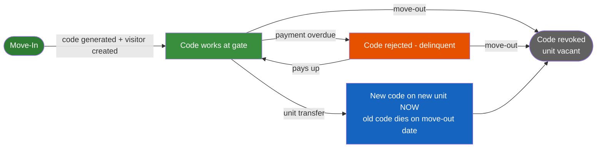

Every arrow above is one Bear command that (1) commits to Bear's database first, then (2) calls OpenTech — never the other way round.

---

## 2. The Big Picture

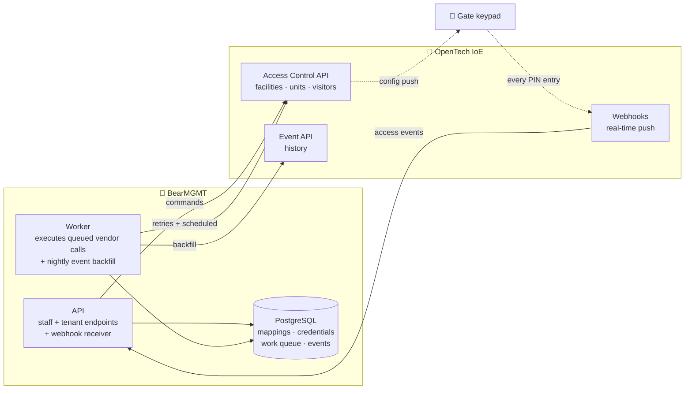

**Four rules carry the design:**

| # | Rule | Why |
|---|---|---|
| 1 | 🔌 **Provider port** — business logic talks to an `IGateAccessProvider` interface, OpenTech is just an adapter behind it | Swap or add vendors later without touching business code — vendor choice is made **per property** |
| 2 | 💾 **DB first, vendor second** — intent committed locally before any vendor call | A vendor-side change with no Bear record would be an invisible security hole. A Bear-side pending row is visible and retryable |
| 3 | 📋 **Work-queue table** (`gate_operations`) — every vendor call is a row the Worker executes, retries with backoff, dead-letters + alerts | Survives restarts and deploys. Future-dated rows = scheduled revocations (transfers). Queryable, cancellable, auditable |
| 4 | 👁 **Events are observational** — webhooks feed dashboards/alerts, never business decisions | A missed webhook can't corrupt state. A nightly poll closes any gaps |

---

## 3. Component View (who lives where)

Clean Architecture holds: Api and Worker depend on Application; Infrastructure implements Application's interfaces; no vendor type ever leaves Infrastructure.

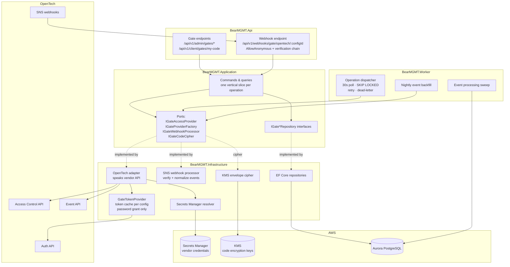

Key implementation notes: three named `HttpClient`s (auth / control / event hosts — they are **separate hosts** at OpenTech), correlation-ID propagated on every outbound call, standard resilience handler (retry/circuit-breaker) inherited globally, all vendor failures surface as `ExternalServiceException` → HTTP 502.

---

## 4. BearMGMT ↔ OpenTech Mapping & Onboarding

### 4.1 The mapping

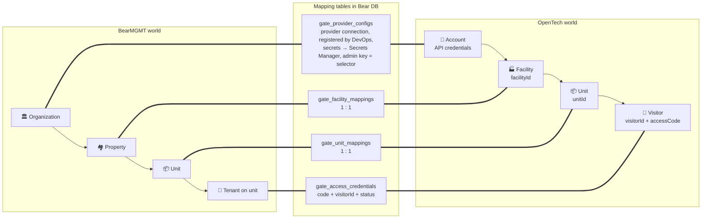

**Dependency rules (who must exist first):**

| Thing | Created by | Rule |
|---|---|---|
| Organization / Property in Bear | Bear only | **No OpenTech prerequisite ever** — gate integration is opt-in later, and **unit creation is never blocked** by missing gate config (client-confirmed) |
| OpenTech account + credentials | Vendor (commercial step) | Needed only when the org wants gate integration |
| Facility | **Bear's Super Admin team, manually, in OpenTech's own portal — no create API exists** | Created **first**, with `propertyNumber` set to equal the Bear property's Code — this is what makes Bear-side linking fully automatic (§4.3) |
| Unit (vendor side) | Either — Bear **can** create via API | Must be mapped before the **first move-in** on that unit; the manual Sync button handles it |
| Visitor | Bear via API at move-in, or via Sync (backfill for pre-existing tenants) | Vendor assigns `visitorId` — no external key, capture it instantly |

**Provider setup is property-first, and the admin's API key is a *selector*, never a credential entry.** ALL secrets are **pre-provisioned in AWS Secrets Manager by DevOps** when the organization's vendor account is set up: the *platform secret* (Bear's `clientId`/`clientSecret` + the three base URLs, one per provider + environment) and the *account secret* (`apiKey` + `apiSecret` per OpenTech account), each registered as a **provider connection** row (`gate_provider_configs`) under the organization. **No secret material ever passes through an admin screen.**

To map a property, the Org Admin opens its gate settings, chooses the provider, and enters **only the API key**. Bear computes the key's **fingerprint** (a keyed hash) and looks it up among the org's provisioned connections:

- **Match found** → Bear loads the secrets from AWS, verifies with a live vendor call, and connects the property to that account. The admin never saw the `apiSecret` — and the key alone cannot authenticate; the secret half stays in AWS.
- **No match** → nothing is created; the admin gets a clear message: *"No provisioned gate account matches this key — contact support/DevOps."*

Entering the same key on five properties connects all five to the **same** connection: one secret, one token cache, one rotation point.

Consequences: an organization can run **multiple providers and multiple vendor accounts at the same time** — each property simply uses whatever connection its keys resolve to. One property = one provider at a time (DB-enforced). Whether vendor accounts are owned per organization or centrally by Bear (reseller model) remains business decision **C-1** (§10) — the property-first flow works identically either way.

### 4.2 Property onboarding — one wizard, everything in property settings

| Step | What the admin does | What Bear does |
|---|---|---|
| 1️⃣ Choose provider + enter API key (selector) | On the property's gate settings: picks the provider (OpenTech), enters **only the API key** — never the secret; all credentials were already provisioned in **AWS Secrets Manager by DevOps** | Computes the key fingerprint and looks it up among the org's provisioned connections. **Match** → loads platform + account secrets from AWS, verifies live (`GET /facilities` — a stale key fails **here**, not weeks later at a move-in), connects the property. **No match** → nothing created, clear error: *"no provisioned gate account matches this key — contact support/DevOps"* |
| 2️⃣ Link facility | **Nothing — fully automatic** (client-confirmed) | Bear's Super Admin already created the OpenTech property with `propertyNumber` = Bear's property Code (§4.1), so Bear calls `GET /facilities/detail?propertyNumber=` and links on the **exact match**, no click needed. **Fallback only:** if no exact match exists (legacy data, typo), a manual-resolution screen appears — pick from a dropdown, same sanity checks as before |
| 3️⃣ Sync units (manual button) | Clicks Sync whenever needed, resolves the review list | Match by `unitNumber` → store vendor `unitId`; **create** vendor-side units missing for Bear units; **push access codes** for units with an active Bear credential but no vendor visitor yet (backfills tenants who moved in *before* gate integration was configured); **report** vendor units unknown to Bear (never auto-import). **Unit-level only — there's no property-level sync**, since properties always originate in OpenTech |
| 4️⃣ Backfill events | — | Pages the vendor Event API into `gate_events` (deduped), sets the sync cursor |
| 5️⃣ Real-time events | — | SNS webhook subscription per vendor account (provisioning process = vendor question V-1); Bear auto-completes the SNS handshake. Already live if another property reused the same connection |

After step 5 the property shows *Gate integration: active* and daily operations are fully automatic. (Full sequence diagram in §9.2.)

**Prerequisite (step 0, before any of the above):** Bear's Super Admin team creates the property directly in OpenTech's own portal — there's no create-facility API — and deliberately sets its `propertyNumber` to equal the Bear property's Code. That single convention is what turns step 2️⃣ from a manual dropdown into a zero-click automatic match.

**Access profile, MVP scope (client-confirmed):** every visitor is created with the vendor's **single default profile** ("24-hour" / "All Access") — there's no admin UI to assign a different time group or access area per tenant. Multi-profile, time-window-restricted access is a future phase.

**Rotation is entirely DevOps-side:** all secret contents (platform *and* account) are updated directly in Secrets Manager by DevOps — admins never touch them; Bear's caches evict on the next persistent 401 and the new values flow with no restart. If the API key itself changes, DevOps also updates the connection's fingerprint. (An org-level read-only "gate connections" list exists purely for visibility — which properties share which connection — it is not a setup surface.)

---

## 5. Lifecycles

### 5.1 Credential lifecycle — `gate_access_credentials.status`

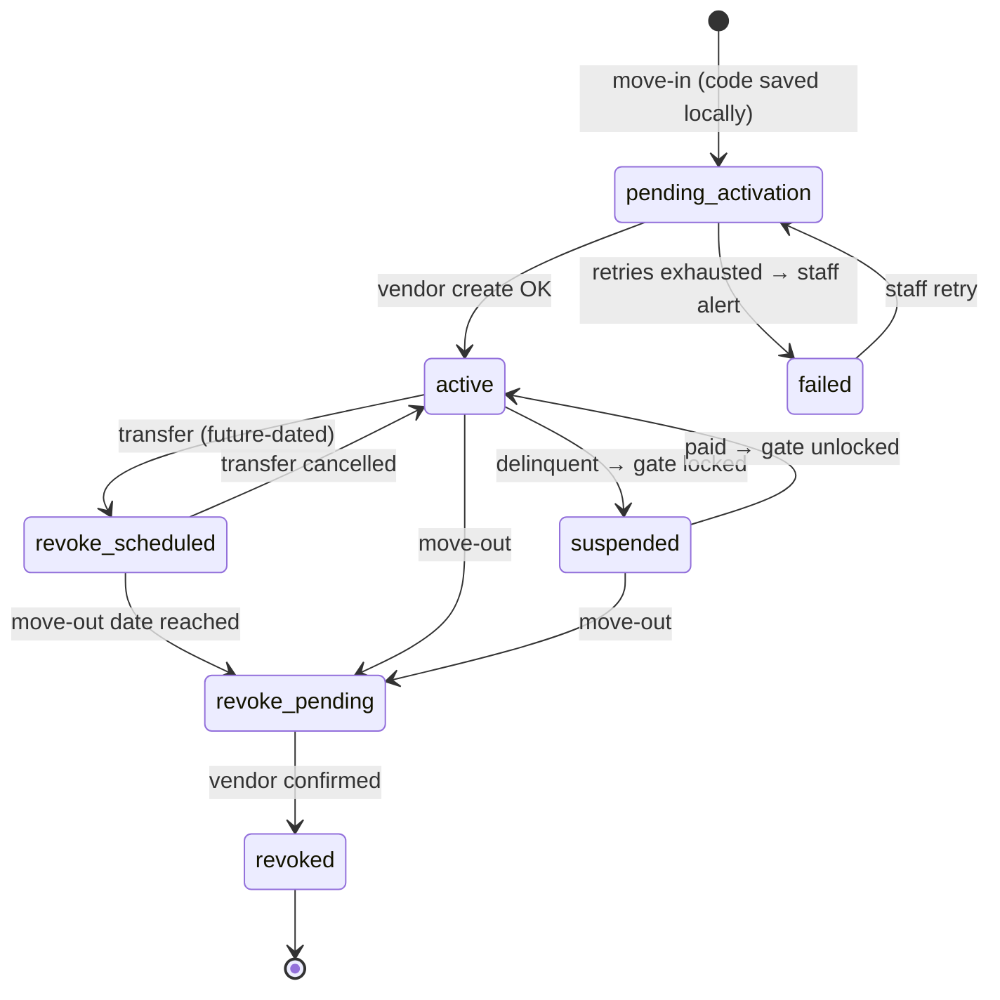

| Business event | Vendor call | Effect at the gate |
|---|---|---|
| Move-in | `POST …/visitors` | Code works, unit → Rented |
| Delinquent | `POST …/visitors/{vid}/disable` (empty body) | Code rejected, record kept |
| Paid | `POST …/visitors/{vid}/enable` (empty body) | Code works again |
| Move-out | `POST …/units/{uid}/vacate` (empty body) | All unit codes dead, unit → Vacant |
| Transfer | new visitor now + **scheduled** vacate later | Both codes live during overlap |

### 5.2 Operation lifecycle — `gate_operations.status` (the work queue)

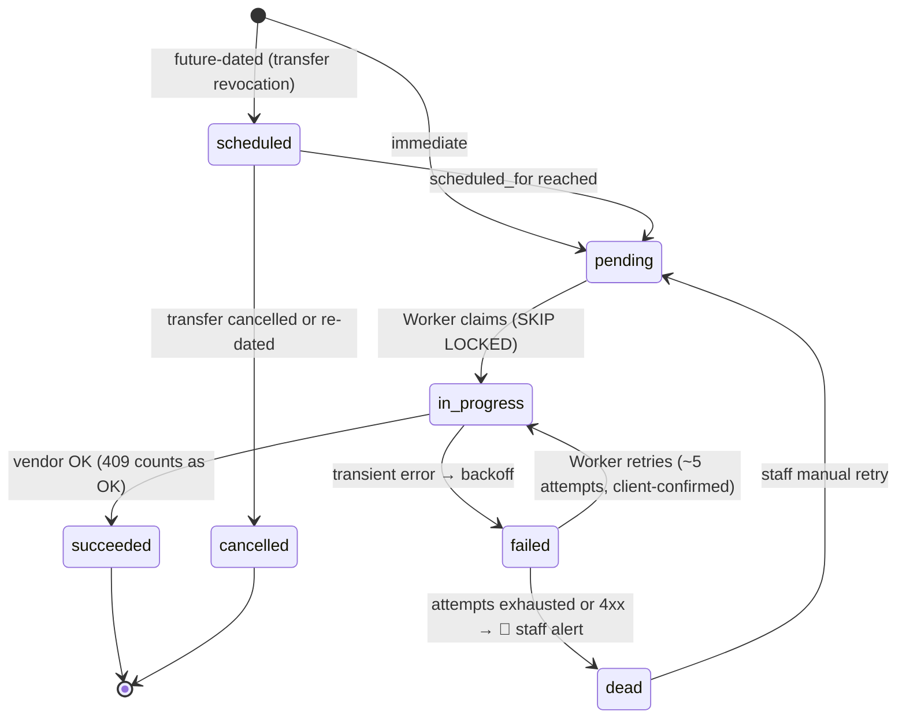

Retry policy: the HTTP layer already retries 5xx quickly (2s/4s/8s); the dispatcher then re-schedules with exponential backoff (max 30 min apart, **~5 attempts** — client-confirmed policy). Revocations that stay failed past **15 minutes** raise the fail-open alert regardless of attempt count — a tenant may still have physical access, which staff can end manually at the vendor console (plus the property's `failure_notification_email` if configured) while Bear keeps retrying.

---

## 6. Database in Detail (7 tables)

All tables: `uuid` PKs (`gen_random_uuid()`), snake_case, org-scoped (`organization_id` + tenant query filters), audit columns + soft delete — except `gate_events`, which is append-only like `audit_logs`.

### 6.1 ER overview

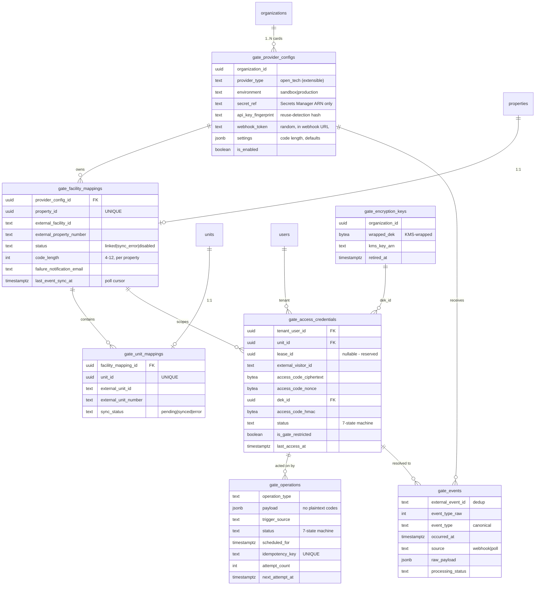

### 6.2 `gate_provider_configs` — a provider connection (registered by DevOps at account provisioning)

Rows are **registered by DevOps** when the organization's vendor account is provisioned (secret stored + row created with its ARN and key fingerprint). The admin UI never creates or modifies these rows — an admin's API-key entry on a property only **looks them up**.

| Column | Meaning |
|---|---|
| `organization_id` | Owning org (tenant isolation) — **0..N connections per org**, one per vendor account |
| `provider_type` | Vendor discriminator, CHECK `('open_tech')` today — a new vendor = new enum value + new adapter |
| `display_name`, `environment` | Set at provisioning (editable), sandbox/production |
| `secret_ref` | **AWS Secrets Manager ARN only** — the account secret `{ apiKey, apiSecret }`, **provisioned and rotated by DevOps**. Base URLs + `clientId`/`clientSecret` live in a separate **platform secret** per provider + environment, also DevOps-managed. Credentials never in the DB, never on any admin screen |
| `api_key_fingerprint` | Keyed hash (HMAC) of the API key, stored at provisioning — **how an admin's entered key selects this connection**. UNIQUE `(organization_id, provider_type, api_key_fingerprint)`. The key itself is not recoverable from it |
| `webhook_token` | Random 256-bit token in the webhook URL — cheap first-line filter before SNS signature checks |
| `allowed_topic_arns` | SNS topic allow-list |
| `settings` (jsonb) | Default `timeGroupId`/`accessProfileId` (default: **omit** — MVP always uses the single default profile; the POC's literal `0` is vendor question V-7), revocation-mode override. Code length is **not** here — it's per-property (§6.3) |
| `is_enabled` | Off = stop dispatching + reject webhooks for every property on this connection |

### 6.3 `gate_facility_mappings` — property ↔ facility (1:1)

| Column | Meaning |
|---|---|
| `property_id` | **UNIQUE** — one gate system per property, ever |
| `provider_config_id` | Which card (→ which account/vendor) this property uses |
| `external_facility_id`, `external_property_number` | Vendor `facilityId` + `propertyNumber` — the latter is now a **deterministic match key** (Super Admin sets it = Property.Code, §4.1), not just a hint |
| `status` | `linked` / `sync_error` (403 = rotated credentials, **or** no exact `propertyNumber` match found) / `disabled` (staged during vendor switch) |
| `code_length` | **Configurable 4–12 per property** (client-confirmed; default 6) — lives here, not on the provider config, since one vendor account can serve multiple properties with different lengths |
| `failure_notification_email` | Client-confirmed MVP feature — alerts this address (plus the in-app indicator) when a sync operation for this property dead-letters |
| `last_synced_at`, `last_event_sync_at`, `last_error` | `last_event_sync_at` is the polling-backfill cursor |

Also `UNIQUE (provider_config_id, external_facility_id)` — a facility can be linked to only one property.

### 6.4 `gate_unit_mappings` — unit ↔ vendor unit (1:1)

| Column | Meaning |
|---|---|
| `unit_id` | **UNIQUE** — Bear unit |
| `facility_mapping_id` | Parent facility link |
| `external_unit_id` | Vendor numeric `unitId` — **required by every visitor call**; no row = no move-in |
| `external_unit_number` | Vendor `unitNumber` string — the sync matching key |
| `sync_status` | `pending` / `synced` / `error` (+ `last_error`, index on `(facility_mapping_id, sync_status)` for reconciliation) |

### 6.5 `gate_access_credentials` — who holds which code (the core aggregate)

| Column | Meaning |
|---|---|
| `tenant_user_id`, `unit_id`, `facility_mapping_id` | Who, where |
| `lease_id` *(nullable, no FK yet)* | Reserved — binds to the Lease module in Phase 2 (deliberate schema debt, cheaper than re-keying later) |
| `external_visitor_id` | Vendor `visitorId`, captured from the create response — **the only correlation key that exists**. CHECK: must be present once status = `active` |
| `access_code_ciphertext` + `access_code_nonce` + `dek_id` | The gate code, AES-256-GCM encrypted under a per-org data key (§7) |
| `access_code_hmac` | Keyed hash (separate key) → powers the uniqueness index below |
| `status` | 7-state machine (§5.1) |
| `is_gate_restricted` | Gate-side flag of the 2×2 matrix — portal lockout is deliberately a *separate* state elsewhere; when set, the tenant portal **withholds the code server-side** |
| `activated_at`, `revoked_at`, `revoke_reason`, `last_access_at` | Timeline + "last gate entry" (fed by events) |

**The constraint that makes codes unique per facility** (a keypad identifies a person by code alone):

```sql
CREATE UNIQUE INDEX ux_gate_credentials_code_per_facility
  ON gate_access_credentials (facility_mapping_id, access_code_hmac)
  WHERE status IN ('pending_activation','active','suspended','revoke_scheduled','revoke_pending')
    AND deleted_at IS NULL;
```

Revoked rows keep their (encrypted) code for audit but release it for reuse — the partial index only guards *live* credentials.

### 6.6 `gate_encryption_keys` — KMS envelope keys

| Column | Meaning |
|---|---|
| `organization_id` | One **active** key per org (partial unique where `retired_at IS NULL`) |
| `wrapped_dek` | Data key wrapped by the KMS master key — plaintext key exists only in process memory |
| `kms_key_arn`, `retired_at` | Which master key, rotation support (old rows still decrypt via their own `dek_id`) |

### 6.7 `gate_events` — append-only event stream

| Column | Meaning |
|---|---|
| `external_event_id` | **UNIQUE per config** — webhook and poll both insert with `ON CONFLICT DO NOTHING`, so the same event lands once no matter the path |
| `event_type_raw` → `event_type` | Vendor enum (18, 17, 15…) → canonical (`access_granted`, `access_denied_delinquent`, `access_denied_invalid_code`, …, `unknown`) |
| `credential_id`, `facility_mapping_id` | Resolved during async processing (nullable at ingest) |
| `code_entered_masked` | If the vendor sends the entered code, Bear stores it **masked** (`****34`) |
| `raw_payload` (jsonb) | Full vendor event, kept for forward compatibility |
| `source`, `processing_status`, `received_at`, `processed_at` | `webhook`/`poll`; `pending → processed/skipped/error` drives the sweep |

Indexes: BRIN on `occurred_at` (big, time-ordered), btree `(facility_mapping_id, occurred_at DESC)` for the events screen, partial on `pending`. Append-only trigger like `audit_logs`; monthly partitioning is a Phase 3 step.

### 6.8 `gate_operations` — outbox + scheduler in one table

| Column | Meaning |
|---|---|
| `operation_type` | `create_visitor`, `update_visitor_code`, `suspend_visitor`, `reinstate_visitor`, `remove_visitor`, `vacate_unit`, `create_unit`, `sync_units`, `backfill_events` |
| `payload` (jsonb) | Canonical request snapshot — **never contains the plaintext code** (executor decrypts from the credential row at send time) |
| `trigger_source` | `move_in` / `move_out` / `transfer_scheduled` / `delinquency` / `manual` / `reconciliation` / `onboarding` |
| `status` | 7-state machine (§5.2) |
| `scheduled_for` | `now()` for immediate work; **future = scheduled revocation**, computed in the property's timezone, re-datable/cancellable until claimed |
| `idempotency_key` | UNIQUE — e.g. `revoke:{credentialId}:{moveOutDate}`; a re-submitted command lands on the existing row |
| `attempt_count`, `next_attempt_at`, `last_error` | Retry machinery (sanitized errors) |
| `correlation_id`, `completed_at` | End-to-end tracing |

Dispatcher hot-path indexes: partial `(next_attempt_at)` for pending/failed, partial `(scheduled_for)` for scheduled; claims use `FOR UPDATE SKIP LOCKED` so multiple Worker instances never collide.

Why one merged table: a scheduled revocation is just an operation whose time hasn't come — one dispatcher, one retry/dead-letter policy, one ops dashboard, instead of duplicating all three.

---

## 7. Gate-Code Security (why encrypted, never hashed, never logged)

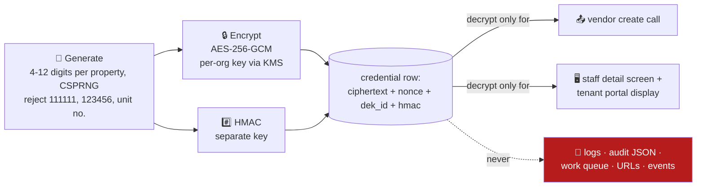

- **Why not hashed:** OpenTech never returns the code on any read (`code: null`), and the tenant portal must display it — Bear's copy is the only recoverable one. Hashing is functionally impossible; plaintext is unacceptable; encryption with controlled, audited reveal is the only fit.
- **Why not pgcrypto:** the key would travel inside SQL text (leaks into DB logs / `pg_stat_statements`). App-level AES + KMS envelope keeps keys off the DB tier entirely.
- **Uniqueness without decryption:** the HMAC column (separate key) feeds the per-facility unique index — collision on insert → regenerate (cap 10, then fail loudly per TM-009's failure-message requirement).
- **Every reveal is audited** (`gate_code.revealed`, actor + portal, never the value). When `is_gate_restricted` is true, the tenant endpoint **omits the code field from the response entirely** — struck-through display is driven by a flag, not a hidden value (TP-004's server-side withholding).
- **A third, "zeroth" state (client-confirmed):** if the property has **no gate system configured at all**, the entire gate-code section is **absent from the tenant UI** — not empty, not struck-through, just not there. This is checked *before* the restricted/active logic above, since it's a different condition (no integration vs. integration-but-restricted).
- Regeneration: new code in the local transaction → `update_visitor_code` operation; if the vendor can't update in place (open question V-2), fallback is remove + recreate visitor (new `visitorId` persisted).
- ⚠ **Vendor conflict, flagged (V-10):** the vendor guide documents `accessCode` as max **10 digits**, but the client wants **up to 12**. Properties configured for 11–12 may be rejected by OpenTech at move-in — confirm with vendor support before relying on the top of the range.

---

## 8. API Essentials (QA-validated)

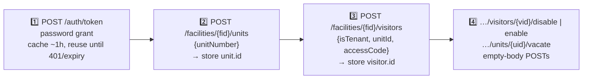

**Token — password grant only (design decision):**

```
POST https://auth.insomniaccia-qa.com/auth/token
Content-Type: application/x-www-form-urlencoded

grant_type=password&client_id={CLIENT_ID}&client_secret={CLIENT_SECRET}
&username={API_KEY}&password={API_SECRET}
```
```json
{ "token_type": "Bearer", "access_token": "eyJ…", "expires_in": 3600, "refresh_token": "…" }
```

> ⚠ The response includes a `refresh_token`, but **Bear does not use it.** Policy: cache the access token per connection (expiry − 60s) and reuse it for every call. When it expires — or any call returns `401` — acquire a **new token with the password grant again**, retry the failed call once, and only then error out. One grant path, one less long-lived credential held in memory.
>
> Where the four values come from: `client_id`/`client_secret` → the **platform secret**; `username`/`password` (= account `apiKey`/`apiSecret`) → the **account secret**. Both are provisioned and rotated by **DevOps** in Secrets Manager — the admin's API-key entry only *selects* which account secret a property uses.

Every call carries `Authorization: Bearer …`, `api-version: 2.0`, `X-Correlation-ID`. Note: control calls and event calls go to **different hosts**.

**Create visitor** (move-in — the important one):

```json
// POST /facilities/8594/visitors
{ "firstName": "Jane", "lastName": "Smith", "isTenant": true,
  "unitId": 38616, "accessCode": "REDACTED-6-DIGITS" }
```
```json
// response — capture visitor.id IMMEDIATELY; note the code is NOT echoed
{ "visitor": { "id": 71035, "isEnabled": true, "unitId": 38616, "code": null },
  "unit":    { "id": 38616, "status": "Rented" } }
```

**Error rules:** `401` → new password-grant token, retry once · `409` → already in that state, treat as success · other `4xx` → don't retry (data problem, dead-letter for humans) · `5xx`/timeout → backoff retry.

---

## 9. All Flows as Sequence Diagrams

### 9.1 🔑 Token acquisition (password grant only)

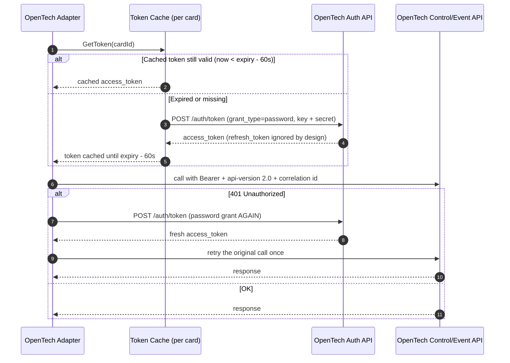

### 9.2 🧭 Property onboarding (provider chosen + keys entered per property)

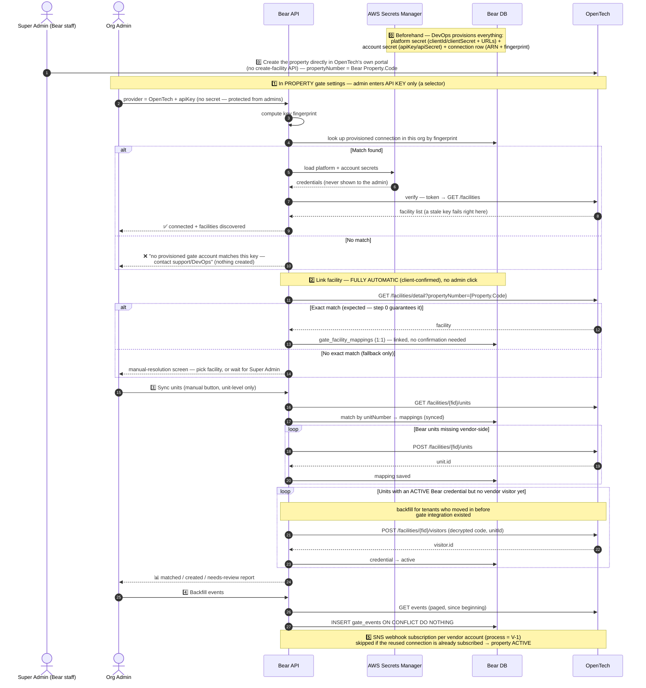

### 9.3 🟢 Move-in

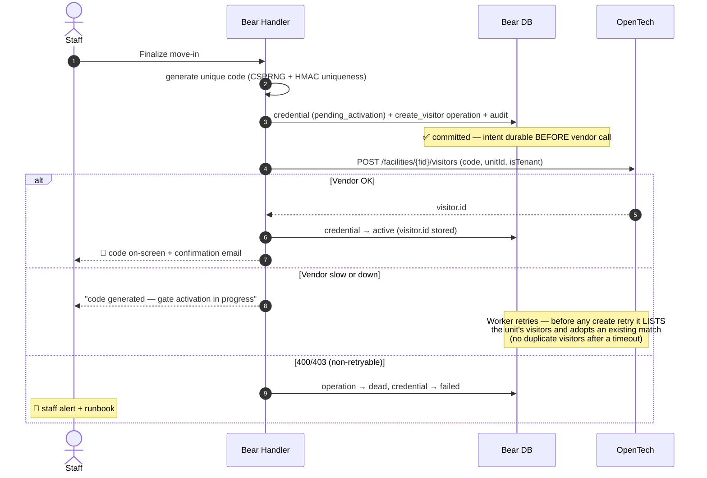

### 9.4 🟠 Delinquency — suspend & reinstate

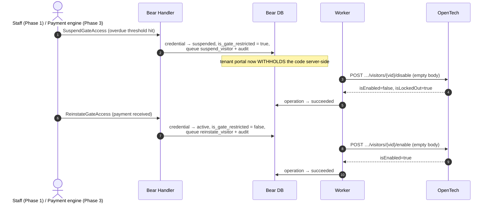

### 9.5 🔴 Move-out

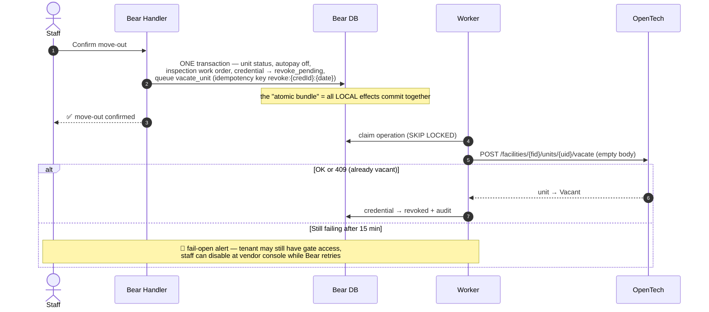

### 9.6 🔵 Unit transfer

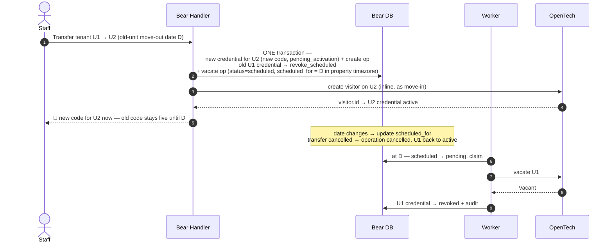

### 9.7 📡 Webhook event ingestion

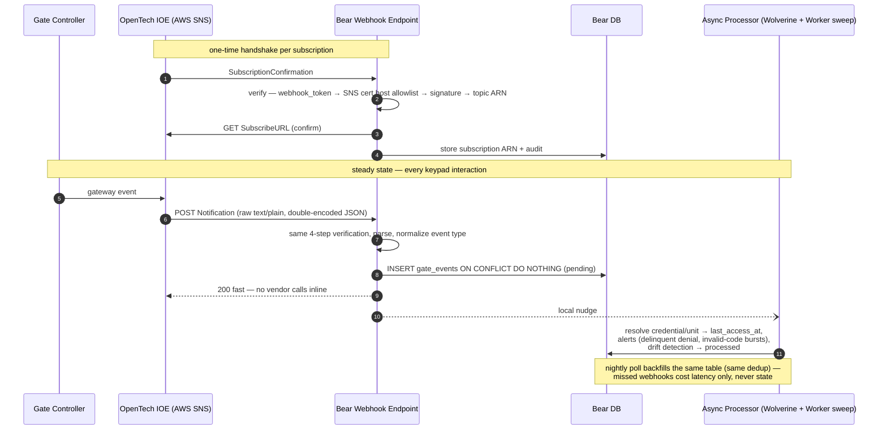

### 9.8 🚪 At the keypad (all vendor-side — Bear only *learns* about it)

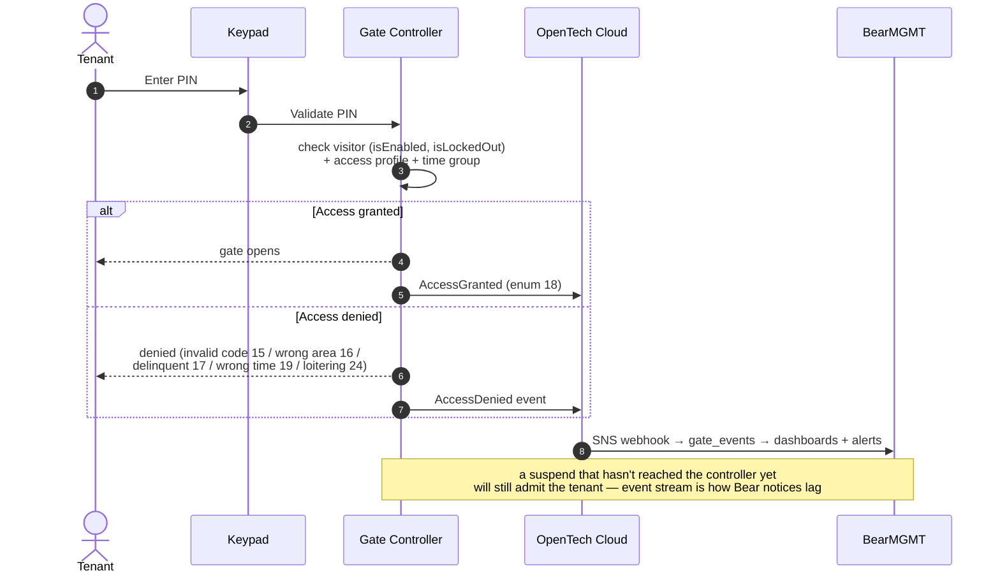

---

## 10. Open Points to Clear ⚠

### ✅ Settled by the client (2026-07-18)

- Code length: **4–12 digits, configurable per property** (not per account) — but see **V-10**, a real conflict with the vendor's documented 10-digit max.
- Access profile: **single default for MVP**, no per-tenant selection.
- Facility linking: **fully automatic** on exact `propertyNumber` match, because Bear's Super Admin creates the OpenTech property first with matching numbers.
- Sync: **unit-level only, manual button**, and it now also **pushes access codes** (backfill for tenants who pre-date gate integration).
- **Unit creation is never blocked** by incomplete gate config.
- Gate code section is **hidden entirely** (not restricted-looking) when a property has no gate integration.
- Retry policy: **~5 attempts**, exponential backoff.
- New MVP feature: **failure-notification email per property**.
- Credential model, finalized: admin enters **only the API key** (a selector); DevOps provisions everything else.
- **Different vendors per property** within one org is a confirmed requirement, not just future-proofing.

### Decisions needed from the client (Bear MGMT product)

| # | Question | Recommendation |
|---|---|---|
| C-1 | **Account model** — one OpenTech account per organization, or single Bear-owned (reseller) account? Commercial/liability call; schema supports both | Per-organization |
| C-2 | Gate code **inside the confirmation email** = plaintext credential in a mailbox. Accept, or portal deep-link instead? | Deep-link |
| C-3 | Transfer cut-over time for old-unit revocation (midnight? end of business? gate closing?) — property timezone | End of day, property-local |
| C-4 | **Fail-open SLA** — how long may a failed revocation persist before staff are alerted? | 15 minutes |
| C-5 | Confirm "overlock" (PM-007) = physical padlock **work order**, not a gate API action | As stated |
| C-6 | Gate MVP ships **staff-triggered** (Lease module doesn't exist yet) — acceptable sequencing? | Yes |
| C-7 | ~~Code length~~ **Settled: 4–12 per property.** Still open: may tenants self-regenerate from the portal? | Staff-only regen first |
| C-8 | Delinquency lock scope: per-visitor (recommended) or whole-unit (vendor unit shows Delinquent)? | Per-visitor |

### Questions for the vendor (OpenTech)

| # | Question | Blocks |
|---|---|---|
| V-1 | How is the **SNS webhook subscription** provisioned per account — self-service or support ticket? (Request IOE developer-portal access early, as "Bear MGMT" dev team) | Onboarding automation |
| V-2 | Can `accessCode` be **updated in place**, or is remove + recreate required? | Code regeneration design |
| V-3 | Rate limits per account/host? Safe concurrency for bulk unit sync? | Dispatcher tuning |
| V-4 | Is `/visitors/{vid}/remove` on a **tenant** visitor officially supported? (Worked in QA; spec says vacate the unit) | Move-out fallback path |
| V-5 | Limits on **multiple enabled visitors per unit**? (Co-tenant/spouse codes will be asked for) | Data model headroom |
| V-6 | Webhook **retry policy + ordering guarantees**, authoritative SNS payload field map | Event pipeline hardening |
| V-7 | Is `timeGroupId`/`accessProfileId` = `0` a "use default" sentinel, or must fields be omitted? (POC sent 0) | Request shape |
| V-8 | Idempotency guidance for **create-visitor after a timeout** (no client key exists) | Duplicate-visitor risk |
| V-9 | **Production credential** provisioning + QA credential rotation process | Go-live |
| V-10 | The guide documents `accessCode` as **1–10 digits max**, but the client wants a **4–12 digit** range. Does OpenTech actually reject 11–12 digit codes? | Whether 11–12 digit properties work at all |

### Internal must-dos before production

| Item | Why |
|---|---|
| 🔑 Rotate the QA credentials currently in the POC `appsettings.json`; never copy them into Bear source | They're live vendor secrets |
| 🛠 Define the **DevOps provisioning runbook**: store platform + account secrets in Secrets Manager and register the connection row (ARN + key fingerprint) per organization | Admin key-entry is a lookup — someone must provision first; this process is the prerequisite for every onboarding |
| ⚙️ Deployment/scaling story for `BearMGMT.Worker` | It gains its first production job (the dispatcher) |
| 📨 Lease, Notifications, Payment module contracts (§21 of the full doc) | They trigger/consume the gate commands in Phases 2–3 |

---

*Full detail — schema DDL and triggers, encryption internals, webhook verification code path, portal display matrix, permissions, observability event IDs, failure runbook, testing strategy, phase plan: [gate-access-control-architecture.md](gate-access-control-architecture.md)*
